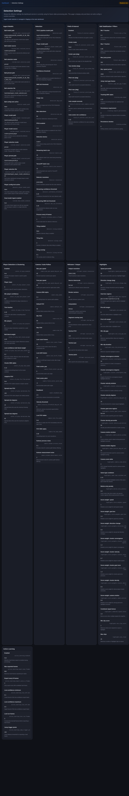

# Soccer360 -- Administrator Guide

A guide for installing, configuring, and maintaining the Soccer360 pipeline server.

---

## Table of Contents

- [Overview](#overview)
  - [System Architecture](#system-architecture)
  - [Prerequisites](#prerequisites)
- [Quick Start Checklist](#quick-start-checklist)
- [Installation](#installation)
  - [Server Preparation](#server-preparation)
  - [Storage Layout](#storage-layout)
  - [Clone and Install](#clone-and-install)
  - [Verify the Container](#verify-the-container)
- [Configuration](#configuration)
  - [Configuration File](#configuration-file)
  - [Paths](#paths)
  - [Detection and Model Settings](#detection-and-model-settings)
  - [Field of Interest](#field-of-interest)
  - [Camera Behavior](#camera-behavior)
  - [Center of Play](#center-of-play)
  - [Rendering](#rendering)
  - [Highlights](#highlights)
  - [Ingest and Archival](#ingest-and-archival)
  - [Watcher and Dedupe](#watcher-and-dedupe)
  - [Active Learning](#active-learning)
  - [Logging](#logging)
- [Model Management](#model-management)
  - [Model Resolution Order](#model-resolution-order)
  - [Using a Custom Model](#using-a-custom-model)
  - [Roboflow Model Setup](#roboflow-model-setup)
  - [NO_DETECT Fallback](#no_detect-fallback)
- [Running the Pipeline](#running-the-pipeline)
  - [Starting Services](#starting-services)
  - [Stopping Services](#stopping-services)
  - [Running a One-Off Job](#running-a-one-off-job)
  - [Checking Service Health](#checking-service-health)
- [Active Learning Workflow](#active-learning-workflow)
  - [Importing Hard Frames into Label Studio](#importing-hard-frames-into-label-studio)
  - [Building the Dataset](#building-the-dataset)
  - [Training a New Model](#training-a-new-model)
  - [Model Promotion](#model-promotion)
  - [TrackNetV3 Training](#tracknetv3-training)
- [Dedupe State Management](#dedupe-state-management)
  - [How Dedupe Works](#how-dedupe-works)
  - [Forcing Reprocessing](#forcing-reprocessing)
  - [Dedupe Tuning](#dedupe-tuning)
- [GPU and Performance](#gpu-and-performance)
  - [Tesla P40 Specifics](#tesla-p40-specifics)
  - [Performance Tuning Options](#performance-tuning-options)
  - [GPU Diagnostics](#gpu-diagnostics)
- [Security](#security)
  - [File Permissions](#file-permissions)
  - [Container Security](#container-security)
  - [Network Exposure](#network-exposure)
- [Monitoring and Metrics](#monitoring-and-metrics)
  - [Monitoring Dashboard](#monitoring-dashboard)
  - [Metadata Metrics](#metadata-metrics)
  - [Per-Phase Timing](#per-phase-timing)
  - [Quality Stats](#quality-stats)
  - [GPU Utilization Snapshot](#gpu-utilization-snapshot)
  - [Using Metrics for Diagnostics](#using-metrics-for-diagnostics)
- [Maintenance](#maintenance)
  - [Log Management](#log-management)
  - [Disk Space Monitoring](#disk-space-monitoring)
  - [Backup Strategy](#backup-strategy)
  - [Updating the Pipeline](#updating-the-pipeline)
  - [Container Verification](#container-verification)
- [Troubleshooting](#troubleshooting)
  - [Worker Won't Start](#worker-wont-start)
  - [GPU Not Available](#gpu-not-available)
  - [Model Resolution Failures](#model-resolution-failures)
  - [Processing Failures](#processing-failures)
  - [Dependency Sync Issues](#dependency-sync-issues)
- [Reference](#reference)
  - [CLI Commands](#cli-commands)
  - [Makefile Targets](#makefile-targets)
  - [Environment Variables](#environment-variables)
  - [Verifier Exit Codes](#verifier-exit-codes)
  - [Docker Compose Services](#docker-compose-services)
  - [Key File Locations](#key-file-locations)

---

## Overview

### System Architecture

Soccer360 is a containerized video processing pipeline. The core architecture:

```text
/tank/ingest/ ──> [Watcher Daemon] ──> [Detection (GPU)] ──> [Tracking (CPU)]
                                              │                      │
                    [Active Learning Export] <─┘              [Player Cluster]
                              │                                      │
              [Camera Path (hybrid blend)] ──> [Broadcast Render (12 workers)]
                     │                                  │
              [Tactical Render] ──> [Highlight Export] ──> /tank/processed/
```

Three Docker services:

- **worker** -- the main pipeline service (GPU-enabled, runs the watcher daemon)
- **dashboard** -- web-based monitoring UI with real-time pipeline progress, GPU/CPU/RAM gauges, training management, and label upload
- **labelstudio** -- optional Label Studio instance for annotating hard frames

All processing uses streaming FFmpeg pipes. No intermediate frame dumps to disk.

### Prerequisites

 | Component | Requirement |
| ----------- | ------------ |
 | OS | Ubuntu 22.04 (bare metal) |
 | CPU | Dual Xeon or equivalent multi-core |
 | RAM | 256 GB |
 | GPU | NVIDIA Tesla P40 (24 GB VRAM) with nvidia-docker runtime |
 | NVMe | 512 GB mounted at `/scratch` |
 | Storage | 4 TB SSD mounted at `/tank` |
 | Software | Docker Engine with BuildKit, Docker Compose v2, NVIDIA Container Toolkit |

## Quick Start Checklist

For first-time setup, complete these steps in order:

- [ ] Server meets hardware prerequisites (above)
- [ ] Docker Engine + NVIDIA Container Toolkit installed
- [ ] Storage mounted: `/tank` (4TB SSD), `/scratch` (512GB NVMe)
- [ ] Directory structure created (see [Storage Layout](#storage-layout))
- [ ] Repository cloned to `/tank/pipeline/soccer360`
- [ ] `bash scripts/install.sh` completed successfully
- [ ] `make verify-container-assets` passes all checks
- [ ] `configs/pipeline.yaml` reviewed and adjusted for your environment
- [ ] `docker compose up -d worker` starts and shows healthy
- [ ] Test ingest: drop a sample video and verify outputs appear

## Installation

### Server Preparation

Ensure NVIDIA drivers and container toolkit are installed:

```bash
# Verify NVIDIA driver
nvidia-smi

# Verify Docker can access GPU
docker run --rm --gpus all nvidia/cuda:12.2.0-runtime-ubuntu22.04 nvidia-smi
```

### Storage Layout

Create the required directory structure:

```bash
# Persistent storage (4TB SSD)
mkdir -p /tank/ingest
mkdir -p /tank/stagging
mkdir -p /tank/processed
mkdir -p /tank/highlights
mkdir -p /tank/models
mkdir -p /tank/labeling
mkdir -p /tank/archive_raw
mkdir -p /tank/logs

# Fast scratch (NVMe)
mkdir -p /scratch/work

# Set ownership (pipeline runs as UID 1000)
chown -R 1000:1000 /tank/ingest /tank/stagging /tank/processed /tank/highlights
chown -R 1000:1000 /tank/models /tank/labeling /tank/archive_raw /tank/logs
chown -R 1000:1000 /scratch/work
```

### Clone and Install

```bash
git clone <repo-url> /tank/pipeline/soccer360
cd /tank/pipeline/soccer360
bash scripts/install.sh
```

The install script:

1. Verifies dependencies (`requirements-docker.txt` vs `pyproject.toml`)
2. Builds the Docker image (`soccer360-worker:local`) via the verifier
3. Runs GPU smoke tests
4. Validates model resolution

### Verify the Container

After installation or any code/config change:

```bash
# Cached build (fast, does not stop running services)
make verify-container-assets

# Clean rebuild (no cache, resets compose state)
make verify-container-assets-clean
```

The verifier checks:

- Dependency sync between `requirements-docker.txt` and `pyproject.toml`
- Image build and SHA integrity
- Model path resolution using runtime Python logic
- Runtime user identity (`getpass.getuser()` must succeed)
- PyTorch/CUDA compatibility
- GPU kernel smoke test (CUDA conv2d)
- Writable `.ultralytics` directory

Useful test commands:

```bash
# Fast targeted host-side slice
pytest tests/test_dashboard.py tests/test_events.py tests/test_watcher.py -q

# Full container test run (worker entrypoint is soccer360, so use python)
docker compose run --rm --entrypoint python worker -m pytest tests/ -v
```

## Configuration

### Configuration File

All pipeline parameters live in `configs/pipeline.yaml`. Override the config path with the `SOCCER360_CONFIG` environment variable.

### Paths

 | Key | Default | Purpose |
| ----- | --------- | --------- |
 | `paths.ingest` | `/tank/ingest` | Queue folder for incoming videos |
 | `paths.stagging` | `/tank/stagging` | Holding folder for UI-managed import/requeue |
 | `paths.scratch` | `/scratch/work` | Fast NVMe temp space (auto-cleaned) |
 | `paths.processed` | `/tank/processed` | Final output directory |
 | `paths.highlights` | `/tank/highlights` | Highlight clip directory |
 | `paths.models` | `/tank/models` | YOLO model weights |
 | `paths.labeling` | `/tank/labeling` | Hard frames and labels |
 | `paths.archive_raw` | `/tank/archive_raw` | Archived original recordings |
 | `paths.logs` | `/tank/logs` | Pipeline log files |

### Detection and Model Settings

**YOLO Detection Pipeline** (the `detection` section):

 | Key | Default | Purpose |
| ----- | --------- | --------- |
 | `detection.path` | `/app/models/yolo26l.pt` | YOLO model file (currently YOLO26l) |
 | `detection.classes` | `[32, 0]` | COCO class IDs to detect (32 = sports ball, 0 = person) |
 | `detection.conf` | `0.10` | Minimum detection confidence (low to capture hard frames) |
 | `detection.iou` | `0.5` | NMS IOU threshold |
 | `detection.img_size` | `960` | Inference image size |
 | `detection.half` | `true` | FP16 inference (supported on P40) |
 | `detection.device` | `cuda:0` | GPU device for inference |

**Detector settings:**

 | Key | Default | Purpose |
| ----- | --------- | --------- |
 | `detector.batch_size` | `16` | Frames per GPU batch |
 | `detector.resolution` | `[1920, 960]` | Detection resolution |
 | `detector.confidence_threshold` | `0.25` | Confidence filter |
 | `detector.process_every_n_frames` | `1` | Frame skip (1 = all, 2 = half) |

**Tiling settings** (for wide-FOV panoramic detection):

 | Key | Default | Purpose |
| ----- | --------- | --------- |
 | `detector.tiling.enabled` | `false` | Enable tiled detection |
 | `detector.tiling.grid` | `[2, 2]` | Tile grid `[rows, cols]` -- use `[1, 4]` for 4 horizontal strips on panoramic footage |
 | `detector.tiling.overlap` | `0.1` | Base overlap fraction between tiles |
 | `detector.tiling.equirect_aware_overlap` | `false` | Boost overlap at horizontal edges (where equirectangular distortion is highest) |
 | `detector.tiling.edge_overlap_boost` | `1.5` | Overlap multiplier applied at horizontal edge tiles when `equirect_aware_overlap` is enabled |

> **Tip:** For 180+ panoramic footage, `[1, 4]` (4 horizontal strips) gives better detection of distant players at frame edges than the default `[2, 2]` grid. The equirectangular overlap boost compensates for higher distortion at horizontal extremes.

**Ball model override** (TrackNetV3 temporal detection):

 | Key | Default | Purpose |
| ----- | --------- | --------- |
 | `detection.ball_model.type` | `yolo` | Ball detection backend: `yolo` (default) or `tracknet` (TrackNetV3 temporal model) |
 | `detection.ball_model.path` | `null` | Path to TrackNetV3 weights (`.pt` file) -- required when `type: tracknet` |
 | `detection.ball_model.input_height` | `288` | TrackNetV3 input height |
 | `detection.ball_model.input_width` | `512` | TrackNetV3 input width |
 | `detection.ball_model.buffer_size` | `3` | Number of frames in temporal window |
 | `detection.ball_model.heatmap_threshold` | `0.5` | Minimum heatmap peak to accept detection |
 | `detection.ball_model.peak_radius` | `5` | Radius for weighted centroid sub-pixel refinement |
 | `detection.ball_model.synthetic_bbox_half` | `5` | Half-size of synthetic bbox created for TrackNetV3 detections |

> **Note:** When `ball_model.type: tracknet`, YOLO still runs for player detection (class 0) but ball detection (class 32) is handled exclusively by TrackNetV3. The TrackNetV3 output is converted to a synthetic bounding box compatible with the downstream pipeline (BallStabilizer, Camera, Highlights). When `ball_model.type: yolo` (default), existing behavior is unchanged.

### Field of Interest

Controls which part of the 360 view is analyzed. Essential when the camera sees multiple fields.

 | Key | Default | Purpose |
| ----- | --------- | --------- |
 | `field_of_interest.enabled` | `true` | Enable FoI filtering |
 | `field_of_interest.center_mode` | `fixed` | `fixed` or `auto` center detection |
 | `field_of_interest.center_yaw_deg` | `0` | Center yaw for fixed mode (0 = camera front) |
 | `field_of_interest.yaw_window_deg` | `160` | Total yaw window (+-80 from center) |
 | `field_of_interest.pitch_min_deg` | `-25` | Minimum pitch (below horizon) |
 | `field_of_interest.pitch_max_deg` | `15` | Maximum pitch (above horizon) |
 | `field_of_interest.auto_sample_seconds` | `30` | Seconds to sample for auto mode |

> **Tip:** If the camera sits between two fields, start with the current tighter default (`center_yaw_deg: 0`, `yaw_window_deg: 160`) and widen only if play is being clipped out.

### Camera Behavior

Controls the virtual broadcast camera movement:

 | Key | Default | Purpose |
| ----- | --------- | --------- |
 | `camera.max_pan_speed_deg_per_sec` | `45.0` | Normal max pan speed |
 | `camera.max_fast_pan_speed_deg_per_sec` | `90.0` | Fast action max pan speed |
 | `camera.ema_alpha` | `0.10` | EMA smoothing (lower = smoother) |
 | `camera.default_fov` | `90.0` | Default field of view (degrees) |
 | `camera.min_fov` / `max_fov` | `80.0` / `100.0` | FOV range |
 | `camera.deadband_deg` | `2.5` | Ignore movements below this angle |
 | `camera.lost_coast_frames` | `30` | Frames to coast on prediction when ball lost |
 | `camera.lost_drift_frames` | `90` | Frames before drifting to field center |

**Cinematic camera features** (all disabled by default):

 | Key | Default | Purpose |
| ----- | --------- | --------- |
 | `camera.spatial_deadzone_enabled` | `false` | Enable spatial dead-zone (suppress pan when ball is in center of frame) |
 | `camera.spatial_deadzone_frac` | `0.30` | Center fraction of FOV that triggers no pan (0.30 = center 30%) |
 | `camera.spatial_deadzone_ramp` | `0.20` | Additional fraction for linear gain ramp between dead-zone and full pan |
 | `camera.lookahead_enabled` | `false` | Enable Kalman velocity lookahead (project target ahead on fast passes) |
 | `camera.lookahead_frames` | `3` | Number of frames to project ahead |
 | `camera.lookahead_max_deg` | `10.0` | Maximum lookahead projection in degrees (prevents overreach on velocity spikes) |

> **Tip:** The spatial dead-zone gives a more natural "broadcast operator" feel where the camera holds steady during normal play and only tracks when the ball approaches the frame edge. Start with the defaults and adjust `spatial_deadzone_frac` based on your footage -- wider FOV cameras may benefit from a larger dead-zone.
>
> **Tip:** Velocity lookahead helps the camera anticipate fast passes. It is self-regulating -- the projection is proportional to Kalman velocity, so it has negligible effect during slow play. Increase `lookahead_frames` for faster-paced matches.

### Center of Play

Controls hybrid camera tracking that blends ball position with player cluster data. When ball detection is unreliable, the camera follows the center of player activity instead of drifting to a static field center.

 | Key | Default | Purpose |
| ----- | --------- | --------- |
 | `center_of_play.enabled` | `true` | Enable hybrid camera tracking |
 | `center_of_play.player_class` | `0` | COCO class ID for person detection |
 | `center_of_play.min_player_conf` | `0.60` | Minimum confidence for player detections |
 | `center_of_play.trim_fraction` | `0.25` | Fraction of outlier players to discard from each end (removes isolated GKs) |
 | `center_of_play.min_players` | `5` | Minimum players required to form a valid cluster |
 | `center_of_play.ball_blend_weight` | `0.05` | Blend weight toward cluster when ball is detected (0 = pure ball, 1 = pure cluster) |
 | `center_of_play.low_conf_ball_blend_weight` | `0.20` | Cluster influence cap when ball confidence is weak |
 | `center_of_play.ema_alpha` | `0.15` | Temporal smoothing for cluster centroid (lower = smoother) |
 | `center_of_play.fov_from_spread` | `true` | Adapt FOV based on how spread out players are |
 | `center_of_play.spread_max_fov` | `105.0` | Maximum FOV when players are very spread out |
 | `center_of_play.spread_min_deg` | `15.0` | Player spread below this uses minimum FOV |
 | `center_of_play.spread_max_deg` | `60.0` | Player spread above this uses maximum FOV |

**Velocity-adaptive blending** (disabled by default):

 | Key | Default | Purpose |
| ----- | --------- | --------- |
 | `center_of_play.velocity_blend_enabled` | `false` | Enable velocity-adaptive ball/cluster blending |
 | `center_of_play.fast_ball_weight` | `0.95` | Ball weight when ball velocity is above fast threshold |
 | `center_of_play.slow_ball_weight` | `0.50` | Ball weight when ball velocity is below slow threshold |
 | `center_of_play.velocity_fast_thresh_deg_per_sec` | `20.0` | Ball angular velocity considered "fast" |
 | `center_of_play.velocity_slow_thresh_deg_per_sec` | `2.0` | Ball angular velocity considered "slow" |

> **Tip:** The current defaults keep confident ball tracking dominant. Increase `low_conf_ball_blend_weight` if you want more center-of-play influence during weak ball detections.
>
> **Tip:** Velocity-adaptive blending replaces the fixed two-tier confidence-based blend with a continuous function of ball speed. Fast ball movement (passes, shots) gives the ball near-full camera control (95%), while slow or stationary ball (stoppage, set piece) blends 50/50 with the player cluster to show the wider context.
>
> **Note:** Player detection uses the pretrained COCO model and is not retrained by the active learning loop. The YOLO26l base model handles person detection on soccer fields, though spectator/parent filtering relies on confidence thresholds and FoI bounds.

### Rendering

 | Key | Default | Purpose |
| ----- | --------- | --------- |
 | `reframer.output_resolution` | `[1920, 1080]` | Output video resolution |
 | `reframer.num_workers` | `12` | Parallel rendering workers |
 | `reframer.overlap_sec` | `0.5` | Segment overlap for clean cuts |
 | `reframer.source_downscale` | `null` | Downscale source before rendering (e.g., `[3840, 1920]`) |
 | `reframer.tactical_fov` | `120` | Tactical view FOV |
 | `exporter.codec` | `libx264` | Video codec |
 | `exporter.crf` | `18` | Quality (lower = better, larger files) |
 | `exporter.encoder` | `cpu` | `cpu` (libx264) or `nvenc` (hardware) |

### Highlights

**Ball-based detectors** (require ball tracking):

 | Key | Default | Purpose |
| ----- | --------- | --------- |
 | `highlights.speed_percentile` | `95` | Speed threshold percentile |
 | `highlights.direction_change_deg` | `90` | Direction change trigger (degrees) |
 | `highlights.goal_box_regions` | (see config) | Normalized goal-box coordinates `[x1, y1, x2, y2]` |
 | `highlights.pre_margin_sec` | `5.0` | Seconds before event in clip |
 | `highlights.post_margin_sec` | `3.0` | Seconds after event in clip |
 | `highlights.min_clip_gap_sec` | `5.0` | Minimum gap between clips (dedup) |
 | `highlights.min_clip_duration_sec` | `3.0` | Minimum clip length |

**Cluster-based detectors** (require `player_cluster.json`, work even without ball tracking):

 | Key | Default | Purpose |
| ----- | --------- | --------- |
 | `highlights.cluster_convergence_window` | `10` | Frames to measure spread decrease |
 | `highlights.cluster_convergence_deg` | `8.0` | Minimum spread decrease to trigger (degrees) |
 | `highlights.cluster_velocity_window` | `5` | Frames for centroid velocity computation |
 | `highlights.cluster_velocity_deg_per_sec` | `15.0` | Centroid speed threshold (degrees/sec) |
 | `highlights.cluster_goal_zone_regions` | `null` | Goal zone regions for cluster (null = reuse `goal_box_regions`) |
 | `highlights.cluster_density_percentile` | `90` | Player count percentile for density spikes |
 | `highlights.camera_motion_window` | `5` | Frames used to measure pan/zoom bursts |
 | `highlights.camera_motion_deg_per_sec` | `12.0` | Camera pan-speed threshold (degrees/sec) |
 | `highlights.camera_zoom_delta` | `4.0` | Minimum FOV change to count as zoom motion |
 | `highlights.same_type_cooldown_sec` | `0.75` | Collapse repeated same-type events inside this window |
 | `highlights.motion_only_penalty` | `0.8` | Down-rank clips that only contain generic motion signals |

**Scoring and ranking:**

 | Key | Default | Purpose |
| ----- | --------- | --------- |
 | `highlights.score_weights` | (see config) | Per-event-type weight multipliers |
 | `highlights.combined_signal_bonus` | `1.5` | Multiplier when a clip combines multiple signal families |
 | `highlights.min_clip_score` | `2.0` | Drop clips scoring below this |
 | `highlights.max_clips` | `20` | Maximum exported highlight clips |

> **Tip:** If you get too many irrelevant highlights, increase `min_clip_score` or lower `motion_only_penalty`. If you miss important moments, reduce `min_clip_score` or relax the camera-motion thresholds. The `score_weights` let you tune which event types matter most — `goal_box` and `cluster_goal_zone` are weighted highest by default since goal-area action is typically most interesting.

### Ingest and Archival

 | Key | Default | Purpose |
| ----- | --------- | --------- |
 | `ingest.archive_on_success` | `true` | Archive originals after processing |
 | `ingest.archive_dir` | `/tank/archive_raw` | Archive destination |
 | `ingest.archive_mode` | `move` | `move`, `copy`, or `leave` |
 | `ingest.archive_name_template` | `{match}_{job_id}{ext}` | Archive filename template |
 | `ingest.archive_collision` | `suffix` | `suffix`, `skip`, or `overwrite` |

> **Note:** Even if archival fails, processed outputs are preserved. The dedupe state prevents reprocessing loops regardless of archival outcome.

### Watcher and Dedupe

 | Key | Default | Purpose |
| ----- | --------- | --------- |
 | `watcher.extensions` | `[".mp4", ".insv", ".mov"]` | Accepted file types |
 | `watcher.ignore_suffixes` | `[".uploading", ".tmp", ".part"]` | Staging file suffixes to skip |
 | `watcher.stability_checks` | `5` | Number of size checks before accepting |
 | `watcher.stability_interval_sec` | `10.0` | Seconds between stability checks |
 | `watcher.processed_state_file` | `watcher_processed_ingest.json` | Dedupe state filename |
 | `watcher.processed_state_max_entries` | `50000` | Max dedupe records (0 = unlimited) |

### Active Learning

 | Key | Default | Purpose |
| ----- | --------- | --------- |
 | `active_learning.enabled` | `true` | Enable hard-frame export |
 | `active_learning.export_max_frames` | `600` | Max frames per match |
 | `active_learning.export_every_n_frames` | `2` | Gating (every Nth candidate) |
 | `active_learning.low_conf_min` | `0.10` | Low confidence band minimum |
 | `active_learning.low_conf_max` | `0.50` | Low confidence band maximum |
 | `active_learning.lost_run_frames` | `5` | Lost-ball streak threshold |
 | `active_learning.jump_trigger_px` | `150` | Jump distance threshold (pixels) |

### Logging

 | Key | Default | Purpose |
| ----- | --------- | --------- |
 | `logging.level` | `INFO` | Log verbosity (`DEBUG`, `INFO`, `WARNING`, `ERROR`) |
 | `logging.file` | `/tank/logs/soccer360.log` | Log file path |

## Model Management

### Model Resolution Order

In YOLO Detection Pipeline mode (when the `detection` section is present), the model is resolved in this order:

1. **`detector.model_path`** -- explicit override (must exist if set to a non-default path)
2. **Runtime selector** -- the dashboard Staging panel can choose `Auto` or a pinned model for future ingest jobs without editing the config file
3. **`detection.path`** -- explicit legacy config path
4. **Default resolver** -- checks `/tank/models/ball_best.pt` first, then falls back to baked `/app/models/yolo26l.pt`

The runtime logs the resolved model once per job:

```text
Model resolved: /tank/models/ball_best.pt (source=default)
```

### Using a Custom Model

Set `detector.model_path` in `configs/pipeline.yaml`:

```yaml
detector:
  model_path: /app/models/my_custom_model.pt
```

> **Warning:** An explicit non-default `detector.model_path` **must** point to an existing file. If the file doesn't exist, the pipeline fails fast with a `RuntimeError`.

Verify resolution:

```bash
docker compose run --rm --no-deps --entrypoint python worker -c "
import os
from src.utils import load_config
from src.detector import resolve_v1_model_path_and_source
cfg = load_config(os.getenv('SOCCER360_CONFIG') or '/app/configs/pipeline.yaml')
p, s = resolve_v1_model_path_and_source(cfg, models_dir=cfg.get('paths',{}).get('models','/app/models'))
print(f'MODEL_PATH={p}')
print(f'MODEL_SOURCE={s}')
"
```

### Roboflow Model Setup

To use a Roboflow-trained model:

```bash
# 1. Place weights on host
mkdir -p /tank/models/roboflow
cp /path/to/best.pt /tank/models/roboflow/football_players_v1.pt

# 2. Set in config
# detector:
#   model_path: /app/models/roboflow/football_players_v1.pt

# 3. Verify
make verify-container-assets
```

In the default compose setup, `/tank/models` is bind-mounted to `/app/models` in the container.

### NO_DETECT Fallback

When no model is available and `mode.allow_no_model: true`:

- Detection, tracking, hard frames, player cluster, and highlights are skipped
- A static camera path at field center is generated
- `broadcast.mp4` has fixed framing; `tactical_wide.mp4` is still produced
- `metadata.json` records `"mode": "no_detect"`

Set `mode.allow_no_model: false` to make a missing model a hard failure instead.

## Running the Pipeline

### Starting Services

```bash
# Start all services (worker + dashboard + Label Studio)
docker compose up -d

# Or start individual services
docker compose up -d worker        # Processing daemon (GPU)
docker compose up -d dashboard     # Monitoring dashboard (port 8088)
docker compose up -d labelstudio   # Label Studio (port 8080)
```

### Stopping Services

```bash
# Stop all services
docker compose down

# Stop worker only
docker compose stop worker
```

### Running a One-Off Job

```bash
# Process a single file (bypasses watcher)
docker compose run --rm worker soccer360 process /tank/ingest/match.mp4

# Keep scratch files for debugging
docker compose run --rm worker soccer360 process /tank/ingest/match.mp4 --no-cleanup
```

### Checking Service Health

Both Docker services have built-in health checks that run automatically:

**Worker health check** (every 60s):

- Verifies `/tank` and `/scratch` are mounted
- Verifies `nvidia-smi` is functional
- Verifies `/tank/logs` is writable

**Label Studio health check** (every 60s):

- HTTP probe against `http://localhost:8080/health`

```bash
# Service status with health indicator
docker compose ps

# Expected output shows (healthy) for running services:
#   soccer360-worker        Up 2 hours (healthy)
#   soccer360-labelstudio   Up 2 hours (healthy)
```

Health check parameters:

 | Parameter | Worker | Label Studio |
| ----------- | -------- | ------------- |
 | Interval | 60s | 60s |
 | Timeout | 10s | 10s |
 | Retries | 3 | 3 |
 | Start period | 30s | 60s |

A service is marked `(unhealthy)` after 3 consecutive failures. Common causes:

 | Unhealthy Service | Likely Cause | Fix |
| ------------------- | ------------- | ----- |
 | Worker | `/tank` or `/scratch` unmounted | Check mount points: `mountpoint /tank` |
 | Worker | GPU inaccessible | Check `nvidia-smi` on host |
 | Worker | `/tank/logs` not writable | Fix permissions: `chown 1000:1000 /tank/logs` |
 | Label Studio | Still initializing | Wait for start period (60s); check `docker compose logs labelstudio` |
 | Label Studio | Process crashed | Restart: `docker compose restart labelstudio` |

```bash
# Follow logs for a specific service
docker compose logs -f worker

# GPU status
nvidia-smi

# Manually run the worker health check inside the container
docker compose exec worker bash /app/scripts/healthcheck.sh
```

## Active Learning Workflow

The full cycle for improving ball detection:

### Importing Hard Frames into Label Studio

After matches are processed, hard frames are at `/tank/labeling/<match>/frames/`.

```bash
# Generate Label Studio task JSON
bash scripts/labelstudio_import.sh <match_name>
```

Then in Label Studio (`http://<server>:8080`):

1. Create a new project
2. Import the generated `tasks.json`
3. Set up a bounding box labeling interface for "ball"
4. Label ball positions in each frame
5. Export annotations in YOLO format to `/tank/labeling/<match>/labels/`

### Building the Dataset

Consolidate all labeled matches into a YOLO dataset:

```bash
bash scripts/build_dataset.sh
```

This creates `/tank/labeling/dataset/` with train/val splits and `dataset.yaml`. The dashboard's **Build Dataset** button now runs the same workflow with native Python logic instead of shelling out to Docker from inside the container.

### Training a New Model

```bash
# Train for 50 epochs (default)
soccer360 train --epochs 50 --data /tank/labeling/dataset/dataset.yaml
```

Training:

- Pins to GPU device 1
- Creates timestamped model: `/tank/models/ball_model_YYYYMMDD_HHMM/`
- Promotes best weights to `/tank/models/ball_best.pt`
- Logs to `/tank/logs/`

`bash scripts/train_ball.sh 50` remains available as a helper wrapper around the same training flow.

### Model Promotion

The training script automatically promotes the best checkpoint to `ball_best.pt`. Future ingest jobs use it only if the ingest selector is set to `Auto` or pinned to `ball_best.pt`; otherwise the worker continues following the configured detection model.

### TrackNetV3 Training

TrackNetV3 is an optional temporal ball detection model that uses 3 consecutive frames to detect motion-blurred or very small balls. Training TrackNetV3 uses the same YOLO-format labels from the active learning pipeline but converts them to Gaussian heatmap targets.

#### Step 1: Build TrackNetV3 heatmap dataset

Via the dashboard API:

```bash
curl -X POST http://localhost:8088/api/training/build-tracknet-dataset \
  -H "Content-Type: application/json" \
  -d '{"input_height": 288, "input_width": 512}'
```

Or via the CLI:

```bash
python scripts/train_tracknet.py \
  --frames /tank/labeling/<match>/images \
  --labels /tank/labeling/<match>/labels \
  --output /tank/models/tracknet_v1 \
  --epochs 100
```

The training script handles heatmap conversion automatically as its first step.

#### Step 2: Train the model

Via the dashboard API:

```bash
curl -X POST http://localhost:8088/api/training/train-tracknet \
  -H "Content-Type: application/json" \
  -d '{"epochs": 100, "batch_size": 8, "lr": 0.001}'
```

Training produces:

- Periodic checkpoints: `tracknet_epoch0010.pt`, `tracknet_epoch0020.pt`, ...
- Best model: `tracknet_best.pt`
- Uses weighted focal loss (optimized for rare ball pixels vs background)
- ReduceLROnPlateau scheduler with patience=10

Monitor progress:

```bash
curl http://localhost:8088/api/training/tracknet-status
```

#### Step 3: Enable TrackNetV3 for inference

Set in `configs/pipeline.yaml`:

```yaml
detection:
  ball_model:
    type: tracknet
    path: /tank/models/tracknet_v1/tracknet_best.pt
```

Restart the worker to apply. YOLO continues handling player detection; only ball detection switches to TrackNetV3.

> **Note:** TrackNetV3 runs per-frame with a 3-frame ring buffer, so there is a slight latency increase compared to YOLO-only detection. The benefit is significantly better recall on motion-blurred and sub-10px balls.

## Dedupe State Management

### How Dedupe Works

The watcher persists a fingerprint of every successfully processed ingest file in a JSON state file (default: `/tank/processed/.state/watcher_processed_ingest.json`). On startup, the watcher loads this state to avoid reprocessing files that remain in the ingest folder (e.g., with `archive_mode: leave` or `copy`).

The dedupe marker is written when processing completes successfully. Even if archival fails afterward, the dedupe still marks the run as done.

### Forcing Reprocessing

Preferred per-match workflow:

1. Use the dashboard's **Remove Processed Match** action
2. Confirm the destructive **Are you sure?** prompt
3. The dashboard deletes processed outputs, highlights, labeling data, built dataset, dashboard history, and the relevant watcher dedupe entries
4. One archived/original source is restored to `/tank/stagging/<match>_reprocess.ext`
5. Use the dashboard **Staging** panel to move the restored file back into ingest

Use the manual global state reset below only when you need a broad administrative reset.

To make the watcher reprocess previously completed files in bulk:

```bash
# 1. Stop the watcher
docker compose stop worker

# 2. Remove the dedupe state
rm -f /tank/processed/.state/watcher_processed_ingest.json
rm -f /tank/processed/.state/watcher_processed_ingest.json.corrupt.*

# 3. Restart
docker compose up -d worker
```

Alternative: change `watcher.processed_state_file` to a new filename in config (starts fresh without losing old state).

### Dedupe Tuning

 | Setting | Default | Guidance |
| --------- | --------- | --------- |
 | `processed_state_max_entries` | `50000` | Higher = longer history, larger file, slower startup. Lower = faster startup, shorter memory. |

## GPU and Performance

### Tesla P40 Specifics

- Compute capability: `sm_61` (Pascal)
- 24 GB VRAM
- FP16 arithmetic supported (no Tensor Cores)
- NVENC hardware encoder available
- The Docker image pins `torch==2.4.1+cu121` for Pascal compatibility

> **Warning:** Newer PyTorch wheels (CUDA 12.8+) may drop Pascal kernel support. Do not upgrade the torch pin without verifying `sm_61` support.

### Performance Tuning Options

 | Optimization | Config Key | Effect |
| ------------- | ----------- | -------- |
 | TensorRT INT8 | `model.backend: tensorrt_int8` | ~4x inference throughput |
 | NVENC encoding | `exporter.encoder: nvenc` | Hardware video encoding |
 | Frame skipping | `detector.process_every_n_frames: 2` | Halves GPU load (interpolates) |
 | Source downscale | `reframer.source_downscale: [3840, 1920]` | Faster rendering |
 | Fewer workers | `reframer.num_workers: 8` | Reduces CPU/memory pressure |

### GPU Diagnostics

```bash
# Check GPU status and memory
nvidia-smi

# Verify PyTorch CUDA in container
docker compose run --rm --no-deps --entrypoint python worker -c "
import torch
print('torch:', torch.__version__)
print('CUDA:', torch.version.cuda)
print('available:', torch.cuda.is_available())
if torch.cuda.is_available():
    print('capability:', torch.cuda.get_device_capability())
    print('arch_list:', torch.cuda.get_arch_list())
"

# Run GPU smoke test
make verify-container-assets
```

## Security

### File Permissions

The container runs as UID/GID `1000:1000`. All `/tank/*` directories should be owned by this user:

```bash
chown -R 1000:1000 /tank/ingest /tank/stagging /tank/processed /tank/highlights
chown -R 1000:1000 /tank/models /tank/labeling /tank/archive_raw /tank/logs
chown -R 1000:1000 /scratch/work
```

Verify:

```bash
ls -la /tank/
```

### Container Security

- Container runs as non-root (numeric UID 1000)
- `pull_policy: never` prevents pulling untrusted images
- Only the nvidia runtime is exposed (no privileged mode needed beyond GPU access)
- No network ports exposed by the worker service

### Network Exposure

- **Dashboard** exposes port `8088`. Provides real-time monitoring, training management, and label upload. Restrict access via firewall on shared networks.
- **Label Studio** exposes port `8080`. Restrict access via firewall if the server is on a shared network.
- The worker service has no exposed ports.

## Monitoring and Metrics

### Monitoring Dashboard

The web dashboard at `http://<server>:8088` provides real-time visibility into pipeline operations:

- **Pipeline progress** -- 9-phase progress bar with timing for the active job
- **GPU utilization** -- live GPU compute and memory gauges (updated every ~5s via SSE)
- **CPU and RAM** -- live system resource gauges (from `/proc/stat` and `/proc/meminfo`, no psutil dependency)
- **Decision prompts** -- interactive approve/reject for pipeline decision points (mode confirmation, post-detection review, hard frame labeling) with countdown timers
- **Job history** -- completed and failed jobs with per-phase timing breakdown
- **Active learning** -- labeling status per match (frame counts, task counts, label counts), Upload button for YOLO label ZIPs, Build Dataset and Train buttons
- **Staging** -- list files in `/tank/stagging` and move the selected file into ingest
- **Processed match reset** -- destructive per-match cleanup with explicit confirmation before removing outputs/history and restoring a source file for requeue
- **Media player** -- preview processed broadcast/tactical outputs

The dashboard streams events via SSE (Server-Sent Events) -- no polling or manual refresh needed.

**Detection Settings page:** The dashboard also includes a read-only Detection Settings page at `/settings/detection`, showing the effective runtime configuration (model paths, thresholds, FoI, camera parameters). Useful for quickly confirming which settings are active without SSH access.



**Stale job cleanup:** On startup, the EventStore automatically marks any jobs left in `running` or `queued` state (from a prior crash or restart) as `failed` with the message "Abandoned: service restarted". This prevents zombie jobs from cluttering the history.

**Configuration** (`configs/pipeline.yaml`):

```yaml
dashboard:
  enabled: true                    # Enable event emission from pipeline
  db_path: /tank/data/dashboard.db # SQLite state store (WAL mode)
  port: 8088                       # Dashboard server port
```

### Metadata Metrics

Every pipeline run also writes detailed per-phase metrics to `metadata.json` under the `phase_metrics` key. This data is collected automatically -- no configuration needed.

### Per-Phase Timing

Each processing phase records its wall-clock duration in seconds:

 | Phase Key | Pipeline Phase | What It Measures |
| ----------- | --------------- | ----------------- |
 | `detection` | Phase 1 | YOLO ball + player detection (GPU) |
 | `tracking` | Phase 2 | BallStabilizer (YOLO pipeline) or ByteTrack (legacy) |
 | `hard_frames` | Phase 2.5 | Active learning / hard frame export |
 | `player_cluster` | Phase 2.7 | Center-of-play player cluster computation |
 | `camera` | Phase 3 | Camera path generation (hybrid blend) |
 | `broadcast_reframe` | Phase 4 | Broadcast video rendering (12 workers) |
 | `tactical_reframe` | Phase 5 | Tactical wide view rendering |
 | `highlights` | Phase 6 | Highlight detection and clip export |
 | `export` | Phase 7 | Output finalization and archival |

Phase timings are also logged to the pipeline log as each phase completes:

```text
Phase 'detection' completed in 1234.567s
Phase 'tracking' completed in 2.345s
```

### Quality Stats

The pipeline records detection and tracking quality metrics:

 | Stat Key | Description |
| ---------- | ------------ |
 | `detection_count` | Total number of ball detections written to `detections.jsonl` |
 | `frames_processed` | Total frames processed by the detector |
 | `track_frames_total` | Total frames in the tracks output |
 | `track_frames_with_ball` | Frames where a ball position was accepted after stabilization |

The ratio `track_frames_with_ball / track_frames_total` indicates model effectiveness. A low ratio (below 50%) suggests the model needs improvement via active learning.

### GPU Utilization Snapshot

A GPU utilization snapshot is captured immediately after the detection phase (the most GPU-intensive phase):

 | Field | Description |
| ------- | ------------ |
 | `gpu_utilization_pct` | GPU compute utilization percentage |
 | `memory_utilization_pct` | GPU memory controller utilization percentage |
 | `memory_used_mb` | GPU memory in use (MB) |
 | `memory_total_mb` | Total GPU memory (MB) |
 | `temperature_c` | GPU temperature (Celsius) |

The snapshot is `null` if `nvidia-smi` is unavailable or fails. This is normal in test environments.

### Using Metrics for Diagnostics

Extract metrics from a processed match:

```bash
# View phase timings for a match
python3 -c "
import json, sys
meta = json.load(open(sys.argv[1]))
pm = meta.get('phase_metrics')
if pm:
    print('Phase timings:')
    for phase, secs in pm['phase_timings_sec'].items():
        print(f'  {phase}: {secs:.1f}s ({secs/60:.1f}m)')
    print()
    print('Stats:')
    for k, v in pm['stats'].items():
        if k != 'gpu_snapshot_post_detection':
            print(f'  {k}: {v}')
    gpu = pm['stats'].get('gpu_snapshot_post_detection')
    if gpu:
        print(f'  GPU: {gpu[\"gpu_utilization_pct\"]}% util, {gpu[\"memory_used_mb\"]}MB/{gpu[\"memory_total_mb\"]}MB, {gpu[\"temperature_c\"]}C')
else:
    print('No phase_metrics (older run)')
" /tank/processed/<match_name>/metadata.json
```

Common diagnostic patterns:

 | Observation | Likely Cause | Action |
| ------------- | ------------- | -------- |
 | `detection` phase time increasing | Larger model or degraded GPU | Check GPU temperature and throttling |
 | `broadcast_reframe` very slow | Source resolution too high | Set `reframer.source_downscale` |
 | Low `track_frames_with_ball` ratio | Model missing the ball frequently | Label more hard frames and retrain |
 | High GPU memory usage | Large batch size | Reduce `detector.batch_size` |
 | GPU temperature above 85C | Insufficient cooling | Check server airflow; consider `detector.process_every_n_frames: 2` |

## Maintenance

### Log Management

Pipeline logs are written to `/tank/logs/soccer360.log`. Set up rotation:

```bash
# Example logrotate config (/etc/logrotate.d/soccer360)
/tank/logs/soccer360.log {
    weekly
    rotate 12
    compress
    missingok
    notifempty
}
```

Docker container logs can be managed via Docker's logging driver configuration.

### Disk Space Monitoring

Key paths to monitor:

 | Path | Contents | Growth Pattern |
| ------ | ---------- | --------------- |
 | `/tank/ingest/` | Pending videos | Clears after processing (if `archive_mode: move`) |
 | `/tank/processed/` | All outputs | Grows per match (~2-4 GB each) |
 | `/tank/highlights/` | Highlight clips | Grows per match (~100-500 MB) |
 | `/tank/archive_raw/` | Archived originals | Grows per match (size of original) |
 | `/tank/labeling/` | Hard frames + labels | Grows per match (~50-200 MB) |
 | `/scratch/work/` | Temp files | Auto-cleaned after each job |
 | `/tank/logs/` | Log files | Continuous growth |

> **Warning:** `/scratch/work/` is auto-cleaned on successful runs. If a job crashes, scratch files may remain. Periodically check and clean stale scratch directories.

### Backup Strategy

Priority backup targets:

1. **`/tank/models/`** -- trained model weights (irreplaceable without retraining)
2. **`/tank/labeling/`** -- labeled data (hours of human effort)
3. **`configs/pipeline.yaml`** -- pipeline configuration
4. **`/tank/processed/`** -- final outputs (reproducible but expensive to regenerate)

Lower priority:

- `/tank/archive_raw/` -- original recordings (can re-ingest if needed)
- `/tank/logs/` -- diagnostic only

### Updating the Pipeline

```bash
cd /tank/pipeline/soccer360

# Pull latest code
git pull

# Rebuild and verify
make verify-container-assets-clean

# Restart services
docker compose down
docker compose up -d worker
```

> **Note:** If config format changed, review `configs/pipeline.yaml` against the updated defaults before restarting.

### Container Verification

Run verification after any of these events:

- Code changes (`git pull`)
- Dockerfile or dependency changes
- Config file changes
- Docker/NVIDIA driver updates

```bash
# Quick check (cached build)
make verify-container-assets

# Full rebuild (no cache)
make verify-container-assets-clean
```

## Troubleshooting

### Worker Won't Start

```bash
# Check container status
docker compose ps worker

# Check logs for errors
docker compose logs worker | tail -50

# Common causes:
# - GPU runtime not available (nvidia-container-toolkit not installed)
# - Port conflicts (if any ports are mapped)
# - Volume mount permission issues
```

### GPU Not Available

```bash
# Check host GPU
nvidia-smi

# Check container GPU access
docker compose run --rm --no-deps --entrypoint nvidia-smi worker

# If "no kernel image" error: PyTorch CUDA mismatch
# The image should pin torch==2.4.1+cu121 for P40 compatibility
```

### Model Resolution Failures

Verifier resolver exit codes:

 | Code | Meaning | Fix |
| ------ | --------- | ----- |
 | `11` | Config path missing/not readable | Check `SOCCER360_CONFIG` and file permissions |
 | `12` | Config parse failure | Validate YAML syntax in `pipeline.yaml` |
 | `13` | Resolver import/runtime failure | Check Python module imports; run with `VERBOSE=1` |

```bash
# Debug model resolution
VERBOSE=1 make verify-container-assets
```

### Processing Failures

- Check `metadata.json` in the output directory for error details
- Check pipeline log: `/tank/logs/soccer360.log`
- Verify input video: `ffprobe /tank/ingest/<file>`
- Check scratch space: `df -h /scratch`
- Check GPU memory: `nvidia-smi`

### Dependency Sync Issues

If `requirements-docker.txt` drifts from `pyproject.toml`:

```bash
# Check sync status
make check-deps-sync

# If mismatch: update requirements-docker.txt to match pyproject.toml
# Then rebuild
make verify-container-assets-clean
```

## Reference

### CLI Commands

 | Command | Purpose |
| --------- | --------- |
 | `soccer360 watch` | Start ingest folder daemon |
 | `soccer360 process <path>` | Process single video |
 | `soccer360 process <path> --no-cleanup` | Process and keep scratch files |
 | `soccer360 train --epochs N --data <yaml>` | Fine-tune YOLO model |
 | `soccer360 dashboard` | Start monitoring dashboard (port 8088) |
 | `soccer360 dashboard --port 9000` | Dashboard on custom port |
 | `soccer360 export-hard-frames <video> <detections>` | Manual hard-frame export |
 | `python scripts/train_tracknet.py --frames <dir> --labels <dir> --output <dir>` | Train TrackNetV3 temporal ball detector |

All commands accept `--config` / `-c` for custom config path.

### Makefile Targets

 | Target | Purpose |
| -------- | --------- |
 | `make start` | `docker compose up -d` |
 | `make stop` | `docker compose down` |
 | `make logs` | `docker compose logs -f worker` |
 | `make verify-container-assets` | Cached build + full verification |
 | `make verify-container-assets-clean` | No-cache rebuild + verification |
 | `make check-deps-sync` | Verify dependency sync only |

### Environment Variables

 | Variable | Default | Purpose |
| ---------- | --------- | --------- |
 | `SOCCER360_CONFIG` | `configs/pipeline.yaml` | Override config file path |
 | `NVIDIA_VISIBLE_DEVICES` | `1` | GPU device index |
 | `PROJECT` | `soccer360` | Compose project name |
 | `IMAGE_TAG` | `soccer360-worker:local` | Docker image tag |
 | `NO_CACHE` | `0` | Force no-cache build |
 | `RESET` | `0` | Run `compose down` before build |
 | `GPU_SMOKE` | `1` | Run CUDA kernel smoke test |
 | `VERBOSE` | `0` | Print resolver stderr diagnostics |
 | `SKIP_DEPS_SYNC` | `0` | Skip dependency sync check |

### Verifier Exit Codes

 | Code | Meaning |
| ------ | --------- |
 | `0` | All checks passed |
 | `1` | General failure |
 | `11` | Config path/readability error |
 | `12` | Config parse/load failure |
 | `13` | Resolver import/runtime failure |

### Docker Compose Services

 | Service | Image | Ports | Health Check | Purpose |
| --------- | ------- | ------- | ------------- | --------- |
 | `worker` | `soccer360-worker:local` | None | `scripts/healthcheck.sh` (mounts, GPU, log write) | Pipeline processing daemon |
 | `dashboard` | `soccer360-worker:local` | `8088` | HTTP `GET /api/status` (30s) | Monitoring UI + training management |
 | `labelstudio` | `heartexlabs/label-studio:latest` | `8080` | HTTP `/health` endpoint | Annotation interface |

### Key File Locations

 | Path | Purpose |
| ------ | --------- |
 | `configs/pipeline.yaml` | Main configuration |
 | `configs/model_config.yaml` | YOLO training config |
 | `/tank/models/ball_best.pt` | Active fine-tuned model |
 | `/app/models/yolo26l.pt` | Baked COCO baseline model (in container) |
 | `/tank/data/dashboard.db` | Dashboard SQLite state (WAL mode) |
 | `/tank/processed/.state/watcher_processed_ingest.json` | Dedupe state |
 | `/tank/logs/soccer360.log` | Pipeline log |
 | `scripts/verify_container_assets.sh` | Container verifier |
 | `scripts/install.sh` | Installation script |
 | `/tank/stagging/` | UI-managed staging/requeue folder |
 | `scripts/train_ball.sh` | Training helper wrapper |
 | `scripts/build_dataset.sh` | Shell dataset builder helper |
 | `scripts/labelstudio_import.sh` | Label Studio importer |
 | `scripts/train_tracknet.py` | TrackNetV3 training script |
 | `src/tracknet.py` | TrackNetV3 model architecture + detector wrapper |
 | `src/tracknet_data.py` | TrackNetV3 data utilities (heatmap generation, dataset loader) |
