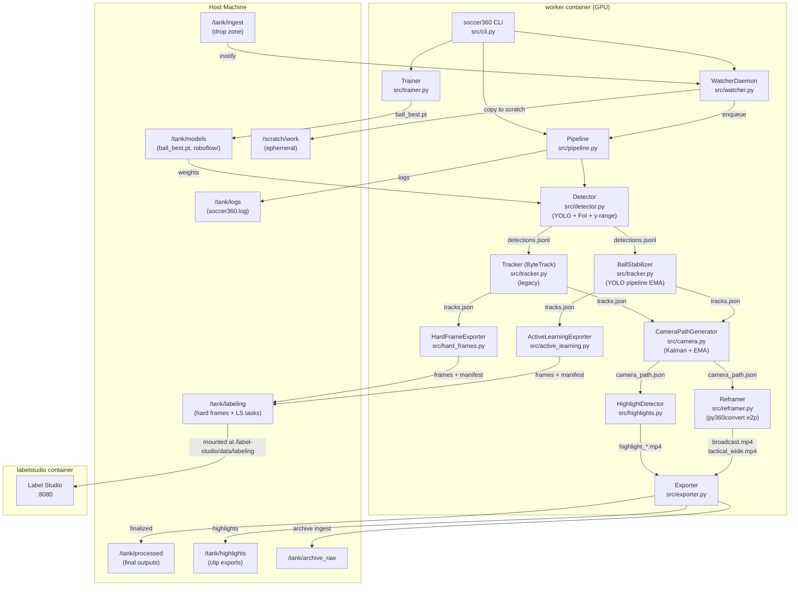
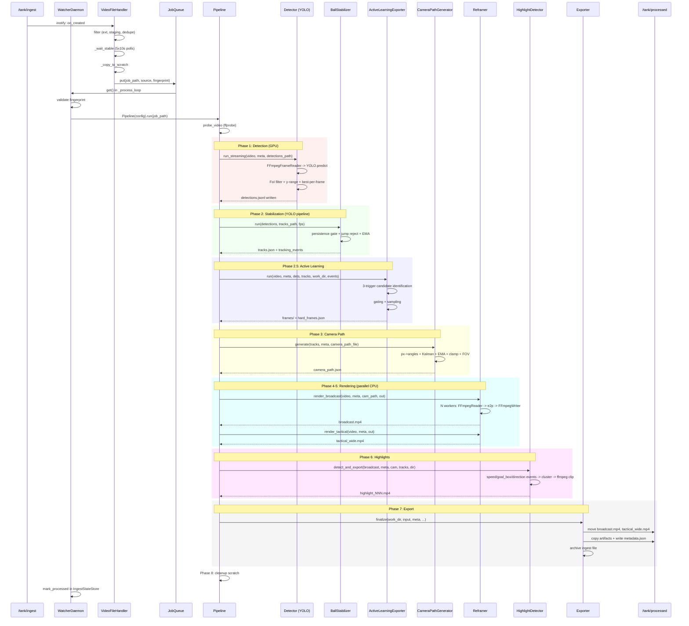

# Soccer360 Functional Review (Final)

> Historical snapshot. For current operator/admin behavior, prefer `README.md`, `docs/operator-guide.md`, and `docs/admin-guide.md`. The live repo now also includes dashboard staging import, processed-match reset/requeue, and dashboard-native dataset build/training flow updates.

## Key reality checks (so nobody builds on imaginary features)

- **Today’s pipeline is ball-first**: it detects/tracks a ball, generates a camera path, renders perspective crops, and exports “hard frames” for labeling/training. **Player detection + action/event understanding are not implemented yet** (they are the next phase).
- **Renders are crops, not annotated broadcasts**: **no overlays** (boxes, trails, labels, scoreboard) exist today; outputs are clean perspective videos.
- **Label Studio pre-annotation gotcha**: the **YOLO-pipeline hard-frames manifest uses `bbox`**, but the current Label Studio import script **only reads `predicted_bbox`**. Unless you normalize this, your imported tasks may have **no pre-drawn boxes**, increasing manual labeling time.

---

## 0) Repo Quick Index

| Path | Purpose |
|---|---|
| `src/` | Main application package (13 modules) |
| `src/pipeline.py` | **The main pipeline** - mode resolution + phase orchestration |
| `src/cli.py` | CLI entry point (`soccer360` console script) |
| `src/detector.py` | YOLO inference, model resolution, FoI, y-range filtering |
| `src/tracker.py` | ByteTrack (legacy) + BallStabilizer (YOLO pipeline) |
| `src/active_learning.py` | YOLO-pipeline hard-frame export (3-trigger system) |
| `src/hard_frames.py` | Legacy hard-frame export |
| `src/camera.py` | Kalman-smoothed camera path generation |
| `src/reframer.py` | 360-to-perspective rendering (broadcast + tactical) |
| `src/highlights.py` | Heuristic highlight detection + clip export |
| `src/exporter.py` | Artifact finalization + ingest archival |
| `src/watcher.py` | Filesystem watcher daemon + persistent dedupe |
| `src/trainer.py` | YOLO fine-tuning + TensorRT export |
| `src/utils.py` | FFmpeg I/O, video probing, equirect math, config |
| `configs/pipeline.yaml` | Runtime configuration |
| `docker-compose.yml` | Two services: `worker` + `labelstudio` |
| `Dockerfile` | CUDA 12.2 + Python 3.11 + baked yolo26l.pt |
| `scripts/` | Operator scripts: install, verify, train, dataset, LS import |
| `tests/` | Pytest suite (15 test modules + conftest fixtures) |
| `docs/` | Server setup docs + future features roadmap |
| `models/` | `.gitkeep` placeholder (weights live at `/tank/models` at runtime) |

---

## 1) Entry Points: "What runs first"

### Docker Compose service definition

`docker-compose.yml:11-12`:
```yaml
command: ["watch"]
```
`Dockerfile:80-81`:
```dockerfile
ENTRYPOINT ["soccer360"]
CMD ["watch"]
```

The effective container command is `soccer360 watch`.

### CLI registration

`pyproject.toml:33`:
```toml
soccer360 = "src.cli:cli"
```

This maps to `src.cli:cli`, a Click group.

### Runtime flow trace

1. **Process starts**: `soccer360 watch` invokes `src/cli.py:47-54` `cli()` -> `watch()`:
   ```python
   @cli.command()
   def watch(ctx):
       daemon = WatcherDaemon(ctx.obj["config"])
       daemon.run()
   ```

2. **Config load**: `src/cli.py:20-44` `cli()` context callback loads YAML via `load_config()` (`src/utils.py:306-309`), sets path defaults, configures `RotatingFileHandler`.

3. **Watcher start**: `src/watcher.py:594-627` `WatcherDaemon.run()`:
   - Creates `/scratch/work`, ingest dir, scratch dir
   - Spawns `_process_loop` thread (daemon, sequential job consumer)
   - Processes existing files in ingest via `_process_existing` (`src/watcher.py:629-634`)
   - Starts `watchdog.Observer` on `ingest_dir` (inotify-backed)
   - Blocks on `observer.join()`

4. **New file detected**: `VideoFileHandler.on_created` / `on_moved` (`src/watcher.py:415-419`) -> `_handle_candidate` -> filters (extension, dotfile, staging suffix, dedupe) -> `_handle_new_file` in thread pool -> `_wait_stable` (size-poll loop, 5 checks x 10s) -> `_copy_to_scratch` -> enqueue `(job_path, ingest_source, fingerprint)`

5. **Job execution**: `src/watcher.py:681-710` `_process_job`:
   - Validates fingerprint hasn't changed (requeues once if stale)
   - Creates `Pipeline(config)` -> `pipe.run(job_path, cleanup=True, ingest_source=...)`
   - On success: marks ingest as processed in `IngestStateStore`

6. **Pipeline phases**: `src/pipeline.py:77-213` `Pipeline.run()`:
   - Phase 1: Detection (GPU)
   - Phase 2: Tracking/Stabilization
   - Phase 2.5: Active learning / hard frame export
   - Phase 3: Camera path generation
   - Phase 4: Broadcast reframing (parallel CPU)
   - Phase 5: Tactical wide view (parallel CPU)
   - Phase 6: Highlights
   - Phase 7: Export to `/tank/processed`
   - Phase 8: Scratch cleanup

---

## 2) Mermaid Flowchart: System Overview



---

## 3) End-to-End Sequence (step-by-step)

When a new `.mp4` file appears in `/tank/ingest/`:

1. **inotify fires** -> `VideoFileHandler.on_created` (`src/watcher.py:415-416`)
2. **Filter checks**: extension in `{.mp4, .insv, .mov}`, not a dotfile, not a staging suffix, not already processed in `IngestStateStore` (`src/watcher.py:421-439`)
3. **Stability wait**: polls `stat().st_size` every 10s, requires 5 consecutive stable readings (`src/watcher.py:485-505`)
4. **Copy to scratch**: `shutil.copy2` to `/scratch/work/{timestamp}_{stem}_{ns}/` (`src/watcher.py:507-517`)
5. **Enqueue**: `job_queue.put((job_dir, ingest_path, fingerprint))` (`src/watcher.py:477`)
6. **Job dequeue** in worker thread: `_process_job` re-validates fingerprint, then `Pipeline(config).run(...)` (`src/watcher.py:681-710`)
7. **`probe_video`**: ffprobe extracts `VideoMeta` (`src/utils.py:35-72`)
8. **Phase 1 - Detection**: `Detector.run_streaming` (`src/detector.py:302-399`):
   - `FFmpegFrameReader` decodes video to RGB numpy arrays via pipe (`src/utils.py:79-148`)
   - Frames scaled to `det_resolution` (default 1920x960)
   - `YOLO.predict()` with YOLO Detection Pipeline params: `classes=[32]`, `conf=0.35`, `half=True` (`src/detector.py:596-624`)
   - FoI filtering (yaw+pitch window) (`src/detector.py:454-518`)
   - Y-range filter (`[0.20, 0.98]` vertical band) (`src/detector.py:728-740`)
   - Best-per-frame selection (`src/detector.py:742-755`)
   - Writes `detections.jsonl` (`src/utils.py:268-273`)
9. **Phase 2 - Stabilization (YOLO pipeline)**: `BallStabilizer.run` (`src/tracker.py:423-580`):
   - Persistence gate (N-of-M window), jump/speed rejection, EMA smoothing
   - Writes `tracks.json`, returns `tracking_events` list
10. **Phase 2.5 - Active Learning**: `ActiveLearningExporter.run` (`src/active_learning.py:64-178`):
    - 3 triggers: low_conf, lost_run, jump_reject
    - Exports up to 600 frames as JPEG to `/tank/labeling/{match}/frames/`
    - Writes `hard_frames.json` manifest
11. **Phase 3 - Camera Path**: `CameraPathGenerator.generate` (`src/camera.py:100-125`):
    - pixel -> (yaw,pitch) -> Kalman filter -> EMA -> pan speed clamp -> FOV computation
    - Writes `camera_path.json`
12. **Phase 4 - Broadcast Render**: `Reframer.render_broadcast` (`src/reframer.py:219-298`):
    - Splits work into N parallel segments (default 12 workers)
    - Each worker: `FFmpegFrameReader` -> `py360convert.e2p()` -> `FFmpegFrameWriter`
    - Segments concatenated via ffmpeg concat demuxer
    - Writes `broadcast.mp4`
13. **Phase 5 - Tactical Render**: `Reframer.render_tactical` (`src/reframer.py:300-379`):
    - Same parallel architecture, fixed camera (yaw=0, pitch=-5, fov=120)
    - Writes `tactical_wide.mp4`
14. **Phase 6 - Highlights**: `HighlightDetector.detect_and_export` (`src/highlights.py:46-87`):
    - Speed events (p95 threshold), goal-box entry, direction changes (>90deg)
    - Clusters into clips, exports from `broadcast.mp4` via ffmpeg `-ss/-t`
    - Writes `highlight_NNN.mp4` to `highlights/`
15. **Phase 7 - Export**: `Exporter.finalize` (`src/exporter.py:51-178`):
    - Moves `broadcast.mp4`, `tactical_wide.mp4` to `/tank/processed/{game}/`
    - Copies highlights to `/tank/highlights/{game}/`
    - Preserves artifacts: `detections.jsonl`, `tracks.json`, `camera_path.json`, `foi_meta.json`, `hard_frames.json`
    - Writes `metadata.json`, `ffprobe_meta.json`, `config_snapshot.json`
    - Archives ingest file per collision policy
16. **Phase 8 - Cleanup**: `shutil.rmtree(work_dir)` (`src/pipeline.py:211-212`)
17. **Post-success**: `IngestStateStore.mark_processed` persists fingerprint (`src/watcher.py:754-790`)

### Mermaid Sequence Diagram



---

## 4) Data Flow + Artifacts (concrete)

| Artifact | Path Pattern | Writer | When | Schema / Key Fields | Downstream |
|---|---|---|---|---|---|
| **detections.jsonl** | `{work_dir}/detections.jsonl` -> `{processed}/{game}/detections.jsonl` | `Detector.run_streaming` -> `write_detections_jsonl` (`src/detector.py:398`, `src/utils.py:268`) | Phase 1 | YOLO pipeline: `{frame_index, time_sec, bbox_xyxy:[x1,y1,x2,y2], conf, class_id}` per line | Stabilizer, AL export, Exporter |
| **tracks.json** | `{work_dir}/tracks.json` -> `{processed}/{game}/tracks.json` | `BallStabilizer.run` (`src/tracker.py:579`) or `Tracker.run` (`src/tracker.py:332`) | Phase 2 | YOLO pipeline: `[{frame, ball:{x,y,bbox,confidence,track_id}, status, reason, raw_det}, ...]` | Camera, Highlights, AL export |
| **foi_meta.json** | `{work_dir}/foi_meta.json` -> `{processed}/{game}/foi_meta.json` | `Detector._filter_foi` (`src/detector.py:493`) | Phase 1 | `{enabled, center_mode, effective_center_yaw_deg, yaw_window_deg, pitch_{min,max}_deg, sample_count, fallback}` | Diagnostics |
| **camera_path.json** | `{work_dir}/camera_path.json` -> `{processed}/{game}/camera_path.json` | `CameraPathGenerator.generate` (`src/camera.py:125`) | Phase 3 | `[{yaw, pitch, fov}, ...]` (per-frame) | Reframer (broadcast), Highlights |
| **broadcast.mp4** | `{processed}/{game}/broadcast.mp4` | `Reframer.render_broadcast` (`src/reframer.py:293`) | Phase 4 | 1920x1080 H.264, CRF 18, ball-following perspective | Highlight clip source, parent delivery |
| **tactical_wide.mp4** | `{processed}/{game}/tactical_wide.mp4` | `Reframer.render_tactical` (`src/reframer.py:377`) | Phase 5 | 1920x1080, fixed 120deg FOV, yaw=0, pitch=-5 | Coaching review |
| **highlight_NNN.mp4** | `{highlights}/{game}/highlight_NNN.mp4` | `HighlightDetector._export_clip` (`src/highlights.py:235-247`) | Phase 6 | Clips from broadcast.mp4, ~3-15s each | Parent/social delivery |
| **hard_frames.json** | `/tank/labeling/{match}/hard_frames.json` + `{work_dir}/hard_frames.json` | YOLO pipeline: `ActiveLearningExporter.run` (`src/active_learning.py:169-173`); Legacy: `HardFrameExporter.run` (`src/hard_frames.py:113-117`) | Phase 2.5 | **YOLO pipeline:** `{..., frames:[{frame_index, time_sec, triggers:[], conf, bbox, exported_path}]}` **Legacy:** `{..., frames:[{..., predicted_bbox, predicted_confidence, ...}]}` **Note:** `labelstudio_import.sh` currently keys off `predicted_bbox` | Label Studio import, training |
| **frames/*.jpg** | `/tank/labeling/{match}/frames/frame_NNNNNN.jpg` | `extract_frame` (`src/utils.py:250-261`) via AL/HF exporters | Phase 2.5 | Full-resolution equirectangular JPEG, single frame | Label Studio annotation |
| **metadata.json** | `{processed}/{game}/metadata.json` | `Exporter.finalize` (`src/exporter.py:164`) | Phase 7 | `{source, job_id, game_name, duration_sec, fps, resolution, processed_at, mode, outputs:{broadcast,tactical,highlights}, ingest_archive_*}` | Run audit |
| **ffprobe_meta.json** | `{processed}/{game}/ffprobe_meta.json` | `Exporter.finalize` (`src/exporter.py:129`) | Phase 7 | `{width, height, fps, duration, total_frames, codec}` | Diagnostics |
| **config_snapshot.json** | `{processed}/{game}/config_snapshot.json` | `Exporter.finalize` (`src/exporter.py:132`) | Phase 7 | Full pipeline config dict | Reproducibility |
| **watcher_processed_ingest.json** | `/tank/processed/.state/watcher_processed_ingest.json` | `IngestStateStore` (`src/watcher.py:332-348`) | Post-success | `{version:1, entries:{path:{fingerprint:{size,mtime_ns,...}, processed_at, job_path}}}` | Restart dedupe |
| **labelstudio/tasks.json** | `/tank/labeling/{match}/labelstudio/tasks.json` | `scripts/labelstudio_import.sh` (`scripts/labelstudio_import.sh:28-93`) | Manual script | `[{data:{image, frame_index, match_name}, predictions:[{result:[{rectanglelabels:["ball"], x, y, width, height}]}]}]` | Label Studio import |
| **dataset.yaml** | `/tank/labeling/dataset/dataset.yaml` | `scripts/build_dataset.sh` (`scripts/build_dataset.sh:99-113`) | Manual script | `{path, train, val, nc:1, names:{0:ball}}` | YOLO training |
| **ball_best.pt** | `/tank/models/ball_best.pt` | `Trainer.run` (`src/trainer.py:49-54`) | Manual training | YOLO weights file | Next pipeline run (auto-resolved) |
| **soccer360.log** | `/tank/logs/soccer360.log` | `RotatingFileHandler` (`src/utils.py:363-370`) | Always | `timestamp | module | level | message`, 20MB x 10 backups | Ops monitoring |

### Label Studio integration

The compose file mounts `/tank/labeling` at `/label-studio/data/labeling` with `LABEL_STUDIO_LOCAL_FILES_SERVING_ENABLED=true` (`docker-compose.yml:37-42`). The import script generates tasks with image paths like `/data/labeling/{match}/frames/{file}`, matching the container mount. Exported YOLO labels are expected at `/tank/labeling/{match}/labels/frame_NNNNNN.txt`.

**Important pre-annotation contract mismatch**

- The YOLO pipeline exporter writes `hard_frames.json` entries with a `bbox` field.
- The current `scripts/labelstudio_import.sh` script only emits pre-annotations when it finds `predicted_bbox`.

**Impact:** YOLO pipeline tasks may import into Label Studio **without any pre-drawn rectangles**, even though the pipeline produced ball boxes.

**Minimal fix (pick one):**
1) Update `scripts/labelstudio_import.sh` to accept either field:
   - use `predicted_bbox` if present, else fall back to `bbox`.
2) Update the YOLO pipeline exporter to also write `predicted_bbox` (and optionally `predicted_confidence`) alongside `bbox/conf` to keep legacy tooling happy.


---

## 5) Functional Features Inventory (what exists today)

### Model resolution/bootstrap behavior

**YOLO Detection Pipeline mode** (active when `detection` section exists in config):

Resolution chain in `resolve_v1_model_path_and_source` (`src/detector.py:127-193`):
- `detector.model_path` (explicit, non-default value must exist or `RuntimeError`) > `detection.path` (legacy) > default
- Default fallback: `{models_dir}/ball_best.pt` (fine-tuned) > `{base_model_path}` (baked `/app/models/yolo26l.pt`) > `None` (if `allow_no_model`)
- Source enum: `detector.model_path` | `detection.path` | `default` | `runtime.auto` | `runtime.pinned`
- Logged once per run at `src/detector.py:315`: `Model resolved: <path> (source=<source>)`

**Legacy mode** (no `detection` section):
Resolution in `resolve_model_path` (`src/detector.py:25-60`):
- `{paths.models}/ball_best.pt` > `config["model"]["path"]` > `/app/models/ball_base.pt` (copies to tank) > `None` -> NO_DETECT

**NO_DETECT mode**: static camera at field center, broadcast+tactical only, no highlights.

### YOLO inference parameters and class filtering

YOLO Detection Pipeline params from `detection` config section (`src/detector.py:207-231`):
```python
self.classes = v1_cfg.get("classes", [32])    # COCO sports ball
self.confidence_threshold = v1_cfg.get("conf", 0.35)
self.nms_iou = v1_cfg.get("iou", 0.5)
self.max_det = v1_cfg.get("max_det", 20)
self.half = v1_cfg.get("half", True)          # FP16
```
Detection resolution: `img_size * 2` x `img_size` = 1920x960 by default.

Legacy params from `detector` config section (`src/detector.py:237-256`):
- Batch size 16 (or 32 for TensorRT), configurable tiling (2x2 with overlap NMS).

### Filters

**FoI (Field-of-Interest)** (`src/detector.py:454-594`):
- Configurable yaw window (+/-100deg from center) + pitch band ([-45, 20] deg)
- `center_mode: fixed` uses `center_yaw_deg`; `auto` computes histogram peak from first N seconds of detections (circular mean over 5-deg bins)
- Writes `foi_meta.json` with effective center, sample count, fallback flag

**Y-range gating** (YOLO Detection Pipeline only) (`src/detector.py:728-740`):
- Rejects detections whose vertical center falls outside `[min_y_frac, max_y_frac]` of detection frame height
- Default: `[0.20, 0.98]` -- removes sky/scoreboard above, below-pitch false positives

**Best-per-frame selection** (YOLO Detection Pipeline only) (`src/detector.py:742-755`):
- Keeps only the highest-confidence detection per frame

**Jump/speed rejection** (YOLO-pipeline BallStabilizer) (`src/tracker.py:502-529`):
- `max_jump_px: 250`, `max_speed_px_per_s: 2500`
- After `jump_max_gap_frames: 15` without acceptance, resets anchor for reacquisition

### Tracking logic

**YOLO-pipeline BallStabilizer** (`src/tracker.py:404-580`):
- Rolling window persistence gate: need `require_persistence` (2) detections in `window` (3) frames
- EMA smoothing: `alpha=0.35`
- Single-ball: operates on pre-selected best-per-frame detections
- Output tracks include `status` (accepted/rejected/lost) and `reason` (persistence/jump/speed)
- Returns `events` list for active learning triggers

**Legacy ByteTrack** (`src/tracker.py:125-256`):
- Kalman filter with constant-velocity model
- Two-stage association: high-conf dets vs tracked, then low-conf vs unmatched
- Multi-factor ball selection (`src/tracker.py:334-397`): 0.6*confidence + 0.4*continuity, with size sanity and jump rejection

### Active learning exports

**YOLO-pipeline ActiveLearningExporter** (`src/active_learning.py:23-257`):

Three triggers (`src/active_learning.py:180-257`):
1. `low_conf`: detection confidence in `[0.20, 0.50]`
2. `lost_run`: consecutive `ball=None` streak reaches threshold (15 frames) -- exactly one representative frame at crossing
3. `jump_reject`: tracking event with `distance_px >= 200`

Gating:
- Rare triggers (`lost_run`, `jump_reject`) bypass modulo gating
- Dense triggers (`low_conf` only) gated by `frame_index % export_every_n_frames == 0`
- Budget: `export_max_frames: 600`, evenly sampled when over

Export: JPEG frames to `/tank/labeling/{match}/frames/`, manifest to `hard_frames.json`

**Legacy HardFrameExporter** (`src/hard_frames.py:31-209`):
- Three criteria: low confidence (<0.3), lost-ball gaps (>=15 frames), position jumps (>150px)
- Random samples down to 500 frames if over budget

### Artifact preservation/exporter behavior

`Exporter.finalize` (`src/exporter.py:51-178`):
- Validates `broadcast.mp4` exists; `tactical_wide.mp4` required by default (`require_tactical: true`)
- Unique output dirs: appends `_runN` suffix to avoid overwrites
- Preserves 5 artifact files + 3 metadata files in output dir
- Ingest archival: `move`/`copy`/`leave` mode, collision policies: `suffix`/`skip`/`overwrite`
- Cross-filesystem safe move with fsync + atomic publish (`src/exporter.py:386-461`)

### Video rendering steps

Two renders exist:
1. **Broadcast** (ball-following): per-frame `py360convert.e2p()` with `camera_path.json` params
2. **Tactical** (fixed wide): same e2p with static yaw=0, pitch=-5, fov=120

Both use parallel `ProcessPoolExecutor` with segment overlap for codec warmup.
Output: 1920x1080, H.264, CRF 18.

**No overlays, no scoreboard, no player annotations** exist today. These are raw perspective crops.

### Dataset packaging/training scripts

| Script | Purpose | Location |
|---|---|---|
| `build_dataset.sh` | Scans `/tank/labeling/*/labels/*.txt` + `frames/*.jpg`, creates train/val splits, writes `dataset.yaml` | `scripts/build_dataset.sh` |
| `train_ball.sh` | Invokes `soccer360 train` inside worker container, versioned runs | `scripts/train_ball.sh` |
| `train.sh` | Simpler training wrapper (no versioning) | `scripts/train.sh` |
| `labelstudio_import.sh` | Generates LS task JSON with pre-annotations from hard_frames.json (**note:** currently expects `predicted_bbox`; YOLO pipeline uses `bbox` unless normalized) | `scripts/labelstudio_import.sh` |

`Trainer.run` (`src/trainer.py:21-57`):
- Fine-tunes from `base_model` (`yolo26l.pt` in current config), imgsz=640, batch=16, patience=10
- Copies best weights to `/tank/models/ball_best.pt`
- Future ingest jobs use it when ingest model selection is set to `Auto` or pinned to that checkpoint

---

## 6) "How to use this TODAY" (operator guide)

### Minimal commands

```bash
# One-time setup
cd /tank/pipeline/soccer360
bash scripts/install.sh

# Start watcher daemon + Label Studio
docker compose up -d worker labelstudio

# Process a single file manually
docker compose run --rm worker soccer360 process /tank/ingest/match.mp4

# View logs
docker compose logs -f worker
tail -f /tank/logs/soccer360.log

# Stop
docker compose down
```

### Ingest path and expected structure

Drop 360 equirectangular video files (`.mp4`, `.insv`, `.mov`) into `/tank/ingest/`. The watcher waits ~50 seconds for size stability before processing.

```
/tank/
├── ingest/           # Drop zone (files archived after success)
├── processed/        # Final outputs per game
│   └── match_stem/
│       ├── broadcast.mp4
│       ├── tactical_wide.mp4
│       ├── metadata.json
│       ├── detections.jsonl
│       ├── tracks.json
│       ├── camera_path.json
│       └── ...
├── highlights/       # Clip exports
├── labeling/         # Hard frames for annotation
├── models/           # Weights (ball_best.pt, roboflow/)
├── archive_raw/      # Archived ingest files
├── logs/             # Rotating log files
└── ...
```

### Confirming it works

1. Check logs for `PIPELINE START` / `PIPELINE COMPLETE` messages
2. Verify `broadcast.mp4` and `tactical_wide.mp4` appear in `/tank/processed/{game}/`
3. Check `metadata.json` for `processing_duration_sec` and `mode`
4. For hard frames: check `/tank/labeling/{game}/frames/` and `hard_frames.json`

### Config tuning

**Ball detection bootstrap vs custom model**:
```yaml
# YOLO Detection Pipeline (COCO yolo26l, class 32 = sports ball)
detection:
  path: "/app/models/yolo26l.pt"        # baked base model inside the image (or provide a local path)
  classes: [32]
  conf: 0.35

# After training a custom BALL model, set an explicit override (takes precedence):
detector:
  model_path: "/tank/models/ball_best.pt"  # adjust if your container mount path differs

# Alternative: omit detector.model_path and just place weights at /tank/models/ball_best.pt
# so the resolver auto-picks it up.
```

**People detection**: NOT currently supported. The pipeline is ball-only. See Gap Analysis below.

**FoI center_mode**:
```yaml
field_of_interest:
  enabled: true
  center_mode: auto    # histogram from first 30s of detections
  # OR
  center_mode: fixed
  center_yaw_deg: 15   # manual offset if camera isn't centered on pitch
```

**Active learning triggers**:
```yaml
active_learning:
  enabled: true
  export_max_frames: 600        # budget per match
  export_every_n_frames: 2      # skip density for low_conf frames
  low_conf_min: 0.20            # widen band = more exports
  low_conf_max: 0.50
  lost_run_frames: 15           # streak threshold
  jump_trigger_px: 200          # jump distance threshold
```

### Producing a labeling batch

#### a) Ball detection

1. Process a video (watcher or manual `process` command)
2. Hard frames are auto-exported to `/tank/labeling/{match}/frames/`
3. Import to Label Studio:
   ```bash
   bash scripts/labelstudio_import.sh <match_name>
   ```
4. Open Label Studio at `http://localhost:8080`, create project, configure Object Detection with label "ball"
5. Import `tasks.json`, annotate bounding boxes
6. Export as YOLO format to `/tank/labeling/{match}/labels/`
7. Build dataset + train:
   ```bash
   bash scripts/build_dataset.sh
   bash scripts/train_ball.sh 50
   ```

**Note on resolution**: Exported frames are **full-resolution equirectangular** (from the source video via `extract_frame`). The detection runs at 1920x960 but labels can be applied to any exported resolution. No cropping strategy is implemented -- the labeler sees the full 360 frame.

#### b) Player detection

**Not supported today.** No class besides `32` (sports ball) is configured. No person detection model or config exists. See Section 7.

#### c) "Action" labels

**Not supported today.** No action/event taxonomy, no temporal annotation workflow, no action classifier exists. See Section 7.

---

## 7) End Goal Gap Analysis

| Capability | Status | Evidence | What's Needed | Dependencies / Risks |
|---|---|---|---|---|
| **Ball training loop** | **Partial** | Full loop exists: pipeline auto-exports hard frames (`src/active_learning.py`), Label Studio integration (`docker-compose.yml:31-45`), dataset builder (`scripts/build_dataset.sh`), trainer (`src/trainer.py`), model auto-promotion to `ball_best.pt` | Loop is manual (human triggers each step). Resolution mismatch: frames exported at source res, detection at 1920x960. No automated eval metrics tracking. | Labeling effort: ~200-500 ball annotations per match to meaningfully improve recall. Small object (ball ~8-20px at det resolution) makes annotation tedious. |
| **Player+action training** | **Missing** | Zero code for person detection. `detection.classes: [32]` is ball-only. No action taxonomy, no temporal event labels. | (1) Person detection model (separate YOLO or unified multi-class), (2) Person tracker (multi-object, re-ID aware), (3) Action event taxonomy, (4) Temporal annotation workflow in Label Studio or equivalent, (5) Action classifier (heuristic, pose, or learned). | Large labeling effort. Multi-class detection adds GPU load. Action recognition is an open research problem even with perfect tracks. |
| **Post-game analytics** | **Missing** | Highlight events are detected but not aggregated (`src/highlights.py:62-66`). No possession stats, heat maps, player tracking stats, or game summary. `metadata.json` has only processing metadata. | (1) Per-player tracking with jersey number/team assignment, (2) Possession model (ball-player proximity), (3) Event aggregation + stats computation, (4) Dashboard/report generator. | Depends on player detection + tracking. Team assignment may require jersey color clustering or manual calibration per game. |
| **Highlights renderer** | **Partial** | Heuristic clip detection exists (`src/highlights.py`) with 3 signal types (speed, goal-box, direction change). Clips are extracted from broadcast.mp4. No overlays, no scoring, no "action-focused" view. | (1) Highlight scoring model (weight different signal types, rank clips), (2) Overlay renderer (ball/player tracks, timestamps, scores), (3) Action-focused camera path (hybrid ball+player centroid), (4) Montage/compilation builder with transitions, (5) Short-form (social) + long-form (full match action) output modes. | Scoring is subjective; needs validation with parents. Overlay rendering adds significant compute. Hybrid camera path requires player detection. |

---

## 8) Next Phase Requirements

### Phase 1: Ball Training Loop Completion (2-4 weeks)

**Goal**: Close the active learning loop to reliable automated ball detection.

**Tasks**:
1. Add resolution-matched frame export (crop equirect at detection resolution around detected/expected ball position)
2. Add automated eval: after training, run inference on val set and log mAP/recall in a `training_report.json`
3. Add `soccer360 evaluate` CLI command to run model on a reference video and compare metrics
4. Wire `build_dataset.sh` + `train_ball.sh` into a single `soccer360 train-loop` command
5. Track model versions in `/tank/models/versions.json` with metrics history

**Milestone**: Ball recall >85% on 3 test matches, fully automated retrain cycle.

### Phase 2: Person Detection + Multi-Object Tracking (4-8 weeks)

**Goal**: Detect and track all visible players per frame.

**Architectural decision: Dual-model vs unified multi-class**

Dual-model is recommended because:
- Ball detection is a tiny-object problem (8-20px at 1920x960). Optimal YOLOv8 for this needs high `imgsz` (960+) and possibly tiling.
- Person detection works well at lower resolution and benefits from different augmentations.
- Training cadences differ: ball model retrains frequently (active learning), person model is more stable.
- YOLO Detection Pipeline architecture already assumes single-class best-per-frame selection in detector -- multi-class would require refactoring the filtering pipeline.

**Code insertion points**:
- New `src/person_detector.py`: similar structure to `Detector` but with `classes=[0]` (COCO person), no FoI, no best-per-frame
- New `src/person_tracker.py`: multi-object tracker (ByteTrack or BoT-SORT) with re-ID features
- `Pipeline.__init__`: add `PersonDetector` + `PersonTracker` alongside existing ball components
- `Pipeline.run`: add Phase 1b (person detection, can run parallel with ball on same GPU if batch-interleaved) and Phase 2b (person tracking)
- New artifacts: `person_detections.jsonl`, `person_tracks.json`
- Config: new `person_detection` and `person_tracker` sections

**Tracking strategy differences**:

| Aspect | Ball | Players |
|---|---|---|
| Object count | 1 | 10-22+ |
| Size | 8-20px | 30-100px |
| Occlusion | Frequent (behind players) | Moderate |
| Motion model | High velocity, non-linear | Slower, more predictable |
| ID persistence | Single track OK | Need re-ID across occlusions |
| Strategy | EMA + persistence gate | BoT-SORT with appearance features |

### Phase 3: Action Recognition (6-12 weeks)

**Options ranked by practicality**:

1. **Heuristic event detection from tracks** (most practical, implement first):
   - Possession: ball-to-nearest-player distance < threshold
   - Shots: high ball speed + direction toward goal
   - Set pieces: ball stationary + player cluster patterns
   - Sprints: player velocity > threshold
   - **Insertion**: new `src/event_detector.py`, runs after ball+player tracking
   - **Output**: `events.json` with `{frame, time_sec, type, players_involved, confidence}`

2. **Pose estimation + action classifier** (medium complexity):
   - Run pose estimator (YOLOv8-pose or ViTPose) on player crops
   - Train lightweight classifier on pose sequences: tackle, header, kick, throw-in
   - Requires annotated pose+action dataset (~1000 clips)
   - **Insertion**: new `src/pose_estimator.py` + `src/action_classifier.py`

3. **Video transformer classifier** (highest quality, longest path):
   - Fine-tune VideoMAE or TimeSformer on soccer action clips
   - Needs ~5000+ labeled video clips
   - Highest accuracy but largest compute/data investment

### Phase 4: Highlight Scoring + Action-Focused Renderer (4-6 weeks)

**Highlight scoring signals**:
- Ball speed events (existing, weight 0.3)
- Goal-box proximity (existing, weight 0.4)
- Direction changes (existing, weight 0.2)
- Player density near ball (new, requires Phase 2)
- Heuristic events: shot, tackle, set piece (new, requires Phase 3)
- Audio peaks (future: crowd noise detection)

**Clip selection logic**:
- Score each event, merge overlapping windows
- Top-N clips by aggregate score
- Minimum diversity constraint (at least M seconds between selected clips)
- New `src/highlight_scorer.py` replaces simple percentile logic

**360 reframing/cropping strategy for "action cam"**:

Target view center signal (hybrid ball+player):
```
center = w_ball * ball_position + w_action * densest_player_cluster_centroid
```
where `w_ball` dominates when ball is visible, `w_action` takes over during lost-ball periods.

Smoothing constraints and cut rules:
- Reuse existing Kalman + EMA + pan speed clamping from `CameraPathGenerator`
- Add hard-cut detection: when ball teleports (goal kick, restart), allow instant camera jump
- Add zoom signal: tighter FOV during close-action, wider during transitions

Overlays:
- Ball track trail (last N frames, fading alpha)
- Player bounding boxes with team colors
- Timestamp + score overlay
- Event labels on screen during highlights

Output formats:
- **Short highlight reel**: top 10-20 clips, 2-5 minutes, with transitions
- **Full match action-focused render**: entire match with hybrid camera, replacing tactical view

**Insertion**: new `src/action_renderer.py` extending `Reframer` with overlay compositing via OpenCV `putText`/`rectangle`.

---

## 9) Minimal Spec Additions (next milestone)

### Milestone: Person Detection + Heuristic Events

#### New modules

| Module | Insertion Point | Purpose |
|---|---|---|
| `src/person_detector.py` | `Pipeline.__init__` after ball detector | YOLO person detection (class 0), batch inference, no FoI needed |
| `src/person_tracker.py` | `Pipeline.run` Phase 2b | Multi-object tracking (ByteTrack adaptation from existing `tracker.py`) |
| `src/event_detector.py` | `Pipeline.run` Phase 2.5b (after person tracking) | Heuristic event detection from ball+player tracks |

#### New config sections

```yaml
# Add to configs/pipeline.yaml
person_detection:
  enabled: true
  model_path: /app/models/yolov8m.pt   # or /tank/models/person_best.pt
  classes: [0]                          # COCO person
  conf: 0.40
  iou: 0.45
  img_size: 640
  max_det: 50
  device: "cuda:0"

person_tracker:
  algorithm: bytetrack
  track_high_thresh: 0.4
  track_low_thresh: 0.2
  track_buffer: 60               # longer buffer for person re-acquisition
  match_thresh: 0.3

events:
  enabled: true
  possession_distance_px: 80     # ball-player proximity threshold
  shot_speed_threshold: 500      # px/sec toward goal
  sprint_speed_threshold: 200    # px/sec sustained for 1s
```

#### New artifacts

| Artifact | Schema | Writer |
|---|---|---|
| `person_detections.jsonl` | `{frame_index, bbox_xyxy, conf, class_id:0}` per line | `PersonDetector.run_streaming` |
| `person_tracks.json` | `[{frame, players:[{track_id, x, y, bbox, conf}]}]` | `PersonTracker.run` |
| `events.json` | `[{frame, time_sec, type, duration_sec, players:[track_id,...], ball_position, confidence}]` | `EventDetector.run` |

#### Pipeline.run changes

```python
# After Phase 2.5 (active learning), add:
if self.person_detector is not None:
    # Phase 1b: Person detection (GPU, can share device with ball detector)
    person_dets_path = work_dir / "person_detections.jsonl"
    self.person_detector.run_streaming(str(input_path), meta, person_dets_path)

    # Phase 2b: Person tracking
    person_tracks_path = work_dir / "person_tracks.json"
    self.person_tracker.run(person_dets_path, person_tracks_path)

    # Phase 2.5b: Event detection
    events_path = work_dir / "events.json"
    self.event_detector.run(tracks_path, person_tracks_path, meta, events_path)
```

These artifacts feed into an enhanced `HighlightDetector` that incorporates event signals alongside existing ball-movement heuristics, and eventually into an `ActionRenderer` for the hybrid camera view.

---

## 10) Hard Evidence Appendix (raw excerpts)

### Worker entrypoint and startup command

`docker-compose.yml:11` (`services.worker`):
```yaml
command: ["watch"]
```

`Dockerfile:80-81`:
```dockerfile
ENTRYPOINT ["soccer360"]
CMD ["watch"]
```

`pyproject.toml:33`:
```toml
soccer360 = "src.cli:cli"
```

### Watcher -> queue -> pipeline handoff

`src/watcher.py:475-478` (`VideoFileHandler._handle_new_file`):
```python
job_dir = self._copy_to_scratch(path)
logger.info("Queued job: %s -> %s", path.name, job_dir)
self.job_queue.put((str(job_dir), str(path), fingerprint))
```

`src/watcher.py:699-701` (`WatcherDaemon._process_job`):
```python
pipe = Pipeline(self.config)
pipe.run(job_path, cleanup=True, ingest_source=ingest_source)
succeeded = True
```

### Pipeline phase order (ground truth)

`src/pipeline.py:116-123` (`Pipeline.run`):
```python
if self.mode == "normal":
    # Phase 1: Ball detection (GPU)
    logger.info("--- Phase 1: Ball Detection (GPU) ---")
    detections_path = work_dir / "detections.jsonl"
    processed_frames = self.detector.run_streaming(
        str(input_path), meta, detections_path
    )
```

`src/pipeline.py:155-158`:
```python
# Phase 3: Camera path generation (CPU)
logger.info("--- Phase 3: Camera Path Generation ---")
self.camera.generate(tracks_path, meta, camera_path_file)
```

`src/pipeline.py:164-174`:
```python
# Phase 4: Broadcast reframing (CPU, parallel)
...
self.reframer.render_broadcast(...)

# Phase 5: Tactical wide view (CPU, parallel)
...
self.reframer.render_tactical(...)
```

`src/pipeline.py:176-188`:
```python
# Phase 6: Highlight detection and export
...
# Phase 7: Export to final destination
output_dir = self.exporter.finalize(...)
```

### Frame decode and streaming I/O

`src/utils.py:112-113,129` (`FFmpegFrameReader.__iter__`):
```python
cmd = ["ffmpeg", "-hide_banner", "-loglevel", "error"]
...
cmd.extend(["-f", "rawvideo", "-pix_fmt", "rgb24", "-"])
```

`src/utils.py:131-143`:
```python
self._proc = subprocess.Popen(cmd, stdout=subprocess.PIPE, stderr=subprocess.PIPE, ...)
...
raw = self._proc.stdout.read(frame_size)
...
frame = np.frombuffer(raw, dtype=np.uint8).reshape(h, w, 3)
yield frame
```

### YOLO Detection Pipeline class filter + y-band + best-per-frame

`src/detector.py:224` (`Detector.__init__`):
```python
self.classes = v1_cfg.get("classes", [32])
```

`src/detector.py:609-613` (`Detector._detect_batch`):
```python
if self._v1_mode:
    predict_kwargs["classes"] = self.classes
    predict_kwargs["max_det"] = self.max_det
    predict_kwargs["half"] = self.half
```

`src/detector.py:375-381` (`Detector.run_streaming`):
```python
# YOLO Detection Pipeline: y-range filter + best-per-frame selection
if self._v1_mode:
    all_detections = self._filter_y_range(...)
    all_detections = self._select_best_per_frame(all_detections)
```

### YOLO Detection Pipeline stabilization gate/jump/speed/EMA

`src/tracker.py:486-493` (`BallStabilizer.run`):
```python
window_buf.append(has_det)
if len(window_buf) > self.window:
    window_buf.pop(0)
det_count = sum(window_buf)
persistent = det_count >= self.require_persistence
```

`src/tracker.py:513-523`:
```python
if dist > self.max_jump_px:
    status = "rejected"
    reason = "jump"
...
elif speed > self.max_speed_px_per_s:
    status = "rejected"
    reason = "speed"
```

`src/tracker.py:542-548`:
```python
ema_x = self.ema_alpha * cx + (1 - self.ema_alpha) * ema_x
ema_y = self.ema_alpha * cy + (1 - self.ema_alpha) * ema_y
...
status = "accepted"
```

### Active-learning trigger logic

`src/active_learning.py:197-201` (`ActiveLearningExporter._identify_candidates`):
```python
for det in detections:
    conf = det.get("conf", det.get("confidence", 0.0))
    if self.low_conf_min <= conf <= self.low_conf_max:
```

`src/active_learning.py:224-225`:
```python
if streak == self.lost_run_frames:
    entry = candidates.setdefault(frame_idx, {...})
```

`src/active_learning.py:243-245`:
```python
if trigger in ("jump_reject", "speed_reject"):
    if distance >= self.jump_trigger_px:
```

### Highlights are heuristic ball-motion clips from broadcast.mp4

`src/highlights.py:64-67` (`HighlightDetector.detect_and_export`):
```python
events.extend(self._detect_speed_events(velocities, fps))
events.extend(self._detect_goal_box_events(tracks, fps))
events.extend(self._detect_direction_changes(velocities, fps))
```

`src/highlights.py:80-82`:
```python
for i, clip in enumerate(clips):
    clip_path = output_dir / f"highlight_{i:03d}.mp4"
    self._export_clip(broadcast_path, clip, clip_path)
```

### Exporter artifact/metadata persistence

`src/exporter.py:104-111` (`Exporter.finalize`):
```python
if mode == "normal":
    artifacts = [
        "detections.jsonl",
        "tracks.json",
        "camera_path.json",
        "foi_meta.json",
        "hard_frames.json",
    ]
```

`src/exporter.py:164-165`:
```python
write_json(summary, output_dir / "metadata.json")
logger.info("Metadata written to %s", output_dir / "metadata.json")
```

### Hard evidence for missing player/action pipeline

No person/action modules in runtime source tree:

```bash
rg -n "person_detection|person_tracker|person_detections|person_tracks|action_classifier|event_detector|events.json|pose" src configs
```

Observed result: no matches.

Pipeline phase list also contains only ball detector/tracker/stabilizer/highlights/export:
`src/pipeline.py:16-24` imports and `src/pipeline.py:116-188` phase execution.

---

## 11) Immediate Change Map (smallest implementation slice)

### Slice A: introduce player detections without changing renderer

1. Add `src/person_detector.py` with API:
```python
class PersonDetector:
    def __init__(self, config: dict): ...
    def run_streaming(self, video_path: str | Path, meta: VideoMeta, output_path: Path) -> int: ...
```

2. Insert in `Pipeline.__init__` (near existing detector creation):
- File: `src/pipeline.py`
- Symbol: `Pipeline.__init__`
- Insertion anchor: after `self.detector = Detector(config)` / mode wiring.

3. Insert in `Pipeline.run` after Phase 1 (ball detection) and before camera path:
- Write `person_detections.jsonl` in `work_dir`.

4. Preserve artifact in exporter:
- File: `src/exporter.py`
- Symbol: `Exporter.finalize`
- Insertion anchor: `artifacts` list for `mode == "normal"`.

### Slice B: track players and emit events

1. Add `src/person_tracker.py`:
```python
class PersonTracker:
    def __init__(self, config: dict): ...
    def run(self, detections_path: Path, output_path: Path): ...
```

2. Add `src/event_detector.py`:
```python
class EventDetector:
    def __init__(self, config: dict): ...
    def run(self, ball_tracks_path: Path, person_tracks_path: Path, meta: VideoMeta, output_path: Path): ...
```

3. Insert new phases in `Pipeline.run`:
- `person_tracks.json` after person detections.
- `events.json` after person tracks.

4. Extend exporter artifacts list with:
- `person_detections.jsonl`
- `person_tracks.json`
- `events.json`

### Slice C: consume events in highlight scoring (without replacing current logic)

1. Extend `HighlightDetector.detect_and_export(...)` signature to optionally accept `events_path`.
2. If present, load `events.json` and add weighted event scores before `_cluster_events`.
3. Keep existing speed/goal_box/direction detectors as baseline fallback.

### Minimum new config keys (additive only)

```yaml
person_detection:
  enabled: true
  model_path: /app/models/yolov8m.pt
  classes: [0]
  conf: 0.4
  iou: 0.45
  img_size: 640
  max_det: 80
  device: "cuda:0"

person_tracker:
  enabled: true
  track_high_thresh: 0.4
  track_low_thresh: 0.2
  new_track_thresh: 0.4
  track_buffer: 60
  match_thresh: 0.3

events:
  enabled: true
  possession_distance_px: 80
  shot_speed_px_s: 500
  sprint_speed_px_s: 200
```

### New artifact contracts (v1)

`person_detections.jsonl`:
```json
{"frame_index": 42, "time_sec": 1.400, "bbox_xyxy": [100,200,140,320], "conf": 0.88, "class_id": 0}
```

`person_tracks.json`:
```json
[
  {"frame": 42, "players": [{"track_id": 7, "x": 120.0, "y": 260.0, "bbox": [100,200,140,320], "confidence": 0.86}]}
]
```

`events.json`:
```json
[
  {"frame": 420, "time_sec": 14.0, "type": "shot", "confidence": 0.74, "players_involved": [7], "ball": {"x": 910.2, "y": 488.7}}
]
```
