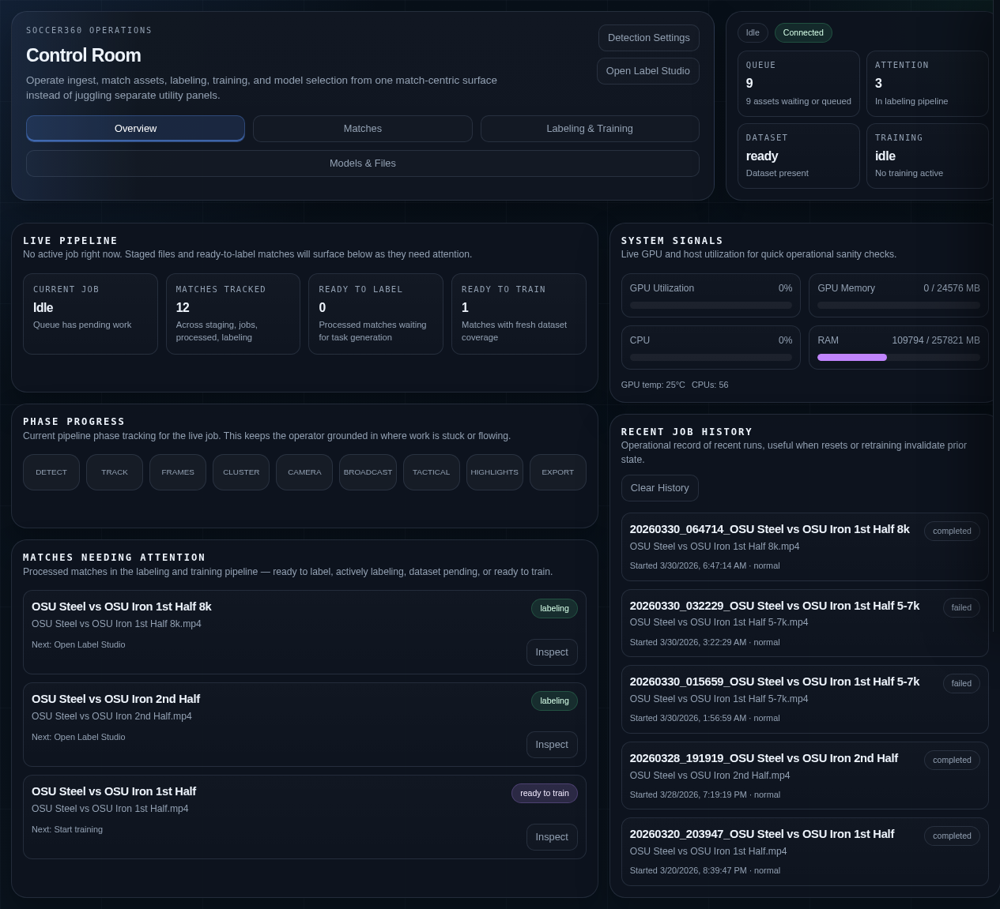
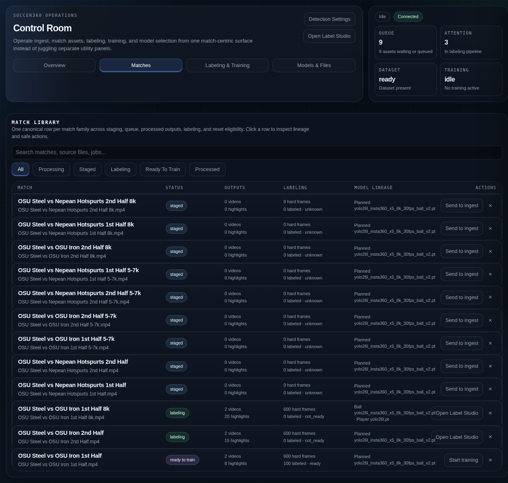
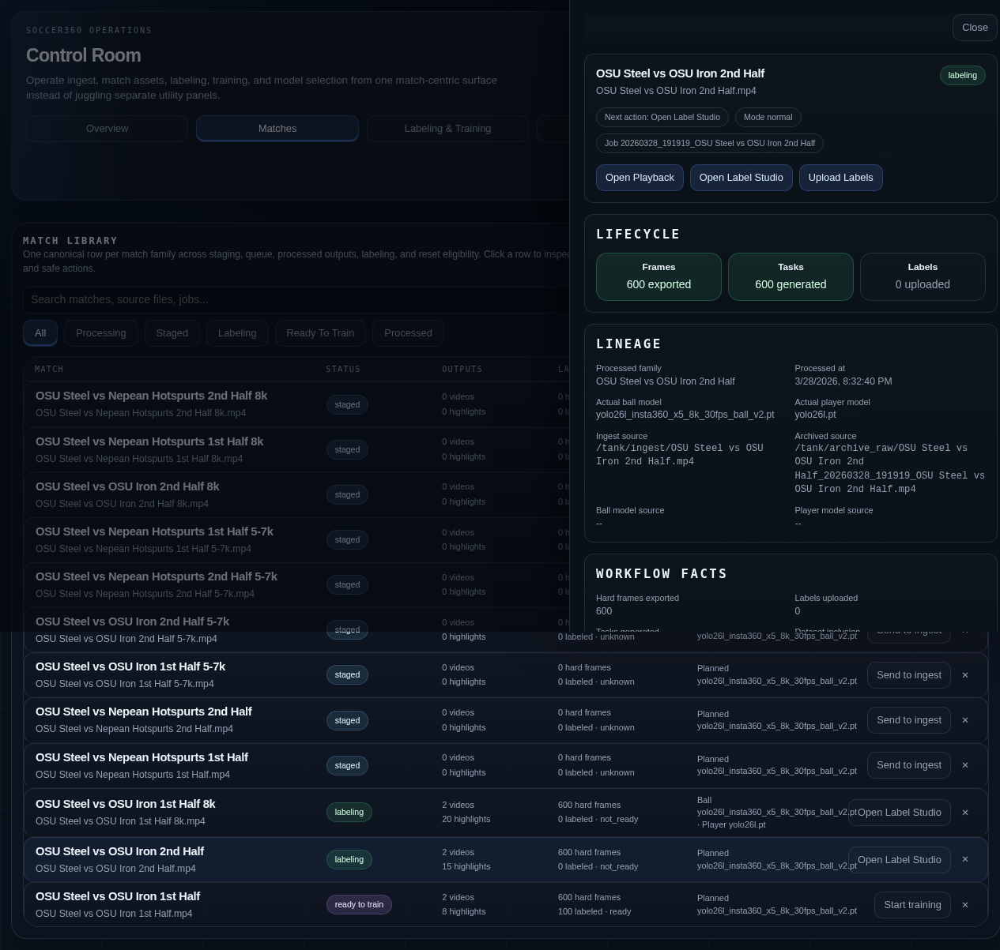
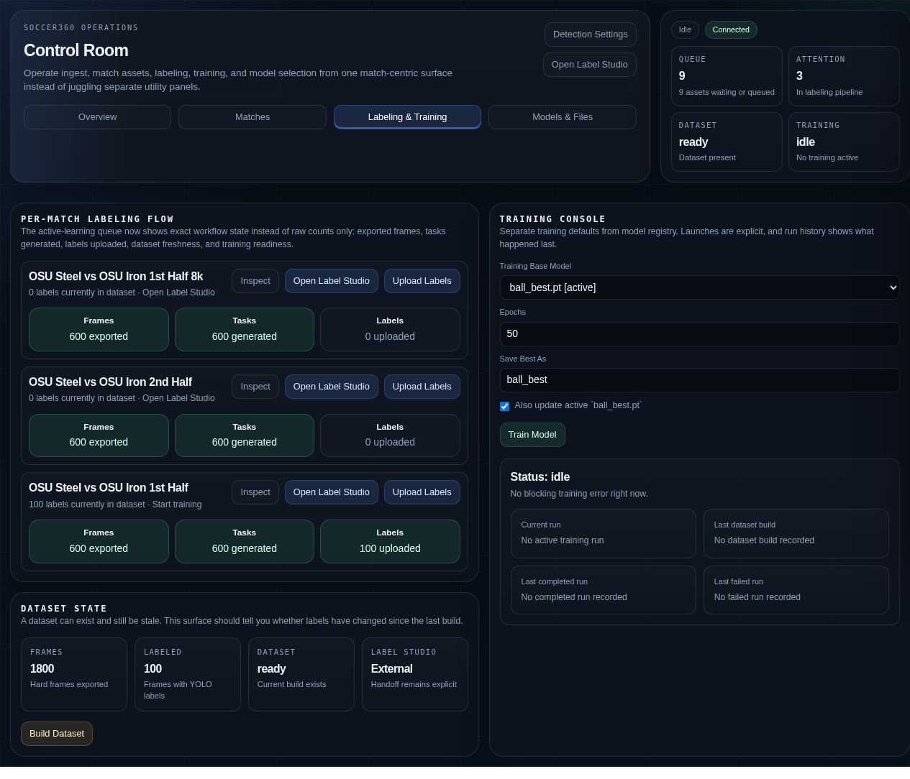
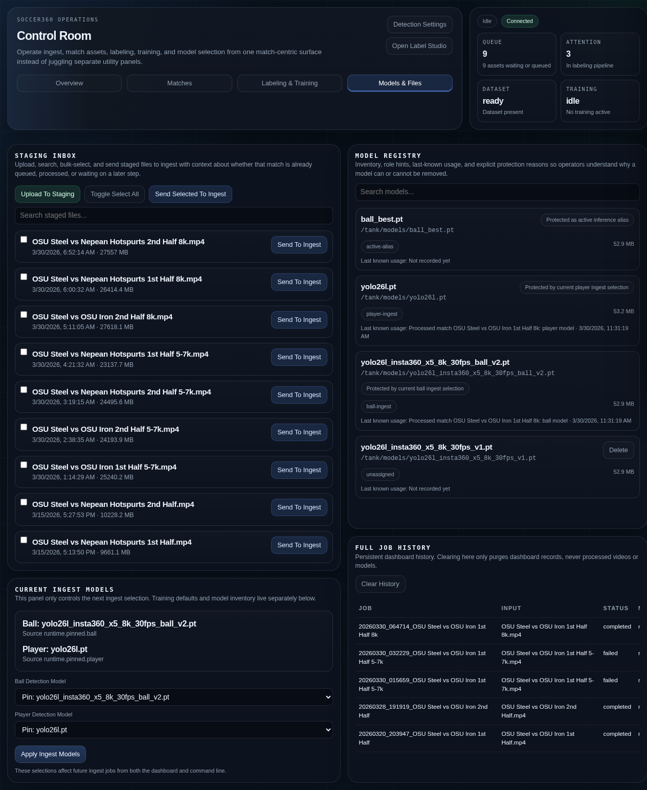
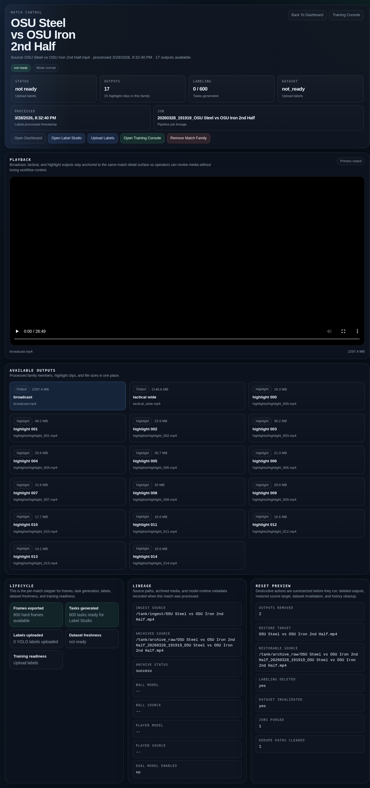

# Soccer360 -- Operator Guide

A guide for day-to-day operation of the Soccer360 pipeline: ingesting match recordings, monitoring processing, retrieving outputs, and improving detection through labeling.

---

## Table of Contents

- [Overview](#overview)
- [Getting Started](#getting-started)
  - [What You Need](#what-you-need)
  - [How the System Works](#how-the-system-works)
- [The Dashboard](#the-dashboard)
  - [Overview Workspace](#overview-workspace)
  - [Matches Workspace](#matches-workspace)
  - [Labeling and Training Workspace](#labeling-and-training-workspace)
  - [Models and Files Workspace](#models-and-files-workspace)
  - [Match Playback Page](#match-playback-page)
- [Ingesting a Match Recording](#ingesting-a-match-recording)
  - [Preparing Your Video](#preparing-your-video)
  - [Uploading via the Dashboard](#uploading-via-the-dashboard)
  - [Dropping a File for Processing](#dropping-a-file-for-processing)
  - [Safe Copy Method](#safe-copy-method)
- [Monitoring Processing](#monitoring-processing)
  - [Using the Dashboard](#using-the-dashboard)
  - [Checking the Worker Status](#checking-the-worker-status)
  - [Viewing Logs](#viewing-logs)
  - [Understanding Processing Phases](#understanding-processing-phases)
- [Retrieving Outputs](#retrieving-outputs)
  - [Broadcast Video](#broadcast-video)
  - [Tactical Wide View](#tactical-wide-view)
  - [Highlight Clips](#highlight-clips)
  - [Metadata and Diagnostics](#metadata-and-diagnostics)
- [Understanding Output Modes](#understanding-output-modes)
- [Active Learning: Improving the Model](#active-learning-improving-the-model)
  - [What Are Hard Frames?](#what-are-hard-frames)
  - [Labeling in Label Studio](#labeling-in-label-studio)
  - [The Weekly Improvement Cycle](#the-weekly-improvement-cycle)
- [Managing Matches](#managing-matches)
  - [Inspecting a Match](#inspecting-a-match)
  - [Reprocessing a Match](#reprocessing-a-match)
  - [Deleting a Match](#deleting-a-match)
- [Troubleshooting](#troubleshooting)
  - [Video Not Being Picked Up](#video-not-being-picked-up)
  - [Processing Seems Stuck](#processing-seems-stuck)
  - [Output Quality Issues](#output-quality-issues)
  - [No Highlights Generated](#no-highlights-generated)
  - [Getting Help](#getting-help)

---

## Overview

Soccer360 takes a 360-degree match recording (from a camera like the Insta360 X5) and automatically produces:

- **Broadcast video** -- an auto-follow view that tracks the action using ball detection and player cluster tracking, mimicking a traditional TV broadcast
- **Tactical wide view** -- a fixed wide-angle perspective of the full pitch
- **Highlight clips** -- short clips of goals, shots, and other key moments

You don't need to edit anything manually. Drop the video in, wait for processing, and collect the results.

## Getting Started

### What You Need

- A 360-degree match recording in **equirectangular MP4 format** (typically 5760x2880 or similar)
- A web browser to access the dashboard at `http://<server-address>:8088`
- Network access to the server's `/tank/ingest/` folder, or use the dashboard's upload feature to stage files

> **Note:** If you recorded with an Insta360 camera, you must first stitch and export to equirectangular MP4 using Insta360 Studio before ingesting. Raw `.insv` files cannot be processed directly.

### How the System Works

The pipeline runs as an always-on background service (the "watcher"). When you place a video file in the ingest folder, the watcher:

1. Detects the new file
2. Waits for it to finish copying (50 seconds of stable file size)
3. Processes it through detection, tracking, camera generation, and rendering
4. Saves outputs to the processed folder
5. Archives the original recording (if configured)

A typical 1-hour match at 5.7K resolution takes approximately 60-90 minutes to process. At 8K (7680x3840) with full-resolution inference, expect 4-5 hours — this is the quality-first overnight mode.

## The Dashboard

The Soccer360 dashboard is your primary interface for managing the pipeline. Open it at `http://<server-address>:8088`. It has four workspaces, accessible via tabs at the top.

### Overview Workspace

The default view shows pipeline status, system health, and matches needing attention.



Key areas:

- **Live Pipeline** -- shows the current job (or "Idle"), with hero metrics for queue depth, matches tracked, ready-to-label count, and ready-to-train count
- **Phase Progress** -- a 9-phase visual strip (Detect, Track, Frames, Cluster, Camera, Broadcast, Tactical, Highlights, Export) that lights up as each phase runs and completes
- **Matches Needing Attention** -- processed matches in the labeling and training pipeline that need operator action (ready to label, actively labeling, dataset pending, or ready to train)
- **System Signals** -- live GPU utilization, GPU memory, CPU, and RAM gauges with temperature readout
- **Recent Job History** -- operational log of completed and failed pipeline runs

The dashboard streams events in real time -- no need to refresh the page. The connection status pill in the top bar shows "Connected" (blue) when live updates are flowing.

### Matches Workspace

The Match Library is your central view of every match across all stages.



- **Search and filter** -- type in the search box to find matches by name, source file, or job ID. Use the filter buttons (All, Processing, Staged, Labeling, Ready To Train, Processed) to narrow the list.
- **Status column** -- colored pill showing the match's current state in the pipeline
- **Actions column** -- context-sensitive button that shows the logical next step for each match (Send to ingest, Generate Tasks, Open Label Studio, Start training, View playback). A delete button (x) appears for matches that can be removed.

Click any row to open the **inspect drawer** with full match details.



The drawer shows the match lifecycle (Frames, Tasks, Labels steps), lineage information (which models were used, when it was processed), output files, and a reset preview if you want to remove the match.

### Labeling and Training Workspace

This workspace manages the active learning loop -- from labeling hard frames to training improved models.



- **Per-Match Labeling Flow** (left column) -- cards for each processed match showing a 3-step progress stepper (Frames exported, Tasks generated, Labels uploaded). Action buttons let you inspect, open Label Studio, or upload labels for each match.
- **Dataset State** (bottom left) -- global summary of all hard frames, labeled count, and dataset freshness. The **Build Dataset** button here combines labels from all matches into one training dataset.
- **Training Console** (right column) -- configure and launch model training. Select a base model, set epochs, name the output, and click **Train Model**. The status card shows current/previous runs and a live training log.

> **Note:** Build Dataset and Train Model are global actions that operate across all matches, not per-match. That's why they appear in their own panels rather than on individual match cards.

### Models and Files Workspace

Manage staged videos, model selection, and the model registry.



- **Staging Inbox** (left) -- upload videos directly from your browser, search staged files, and send them to the ingest queue individually or in bulk
- **Current Ingest Models** (right top) -- choose which ball and player detection models the pipeline uses for the next processing run
- **Model Registry** (right middle) -- browse all available models with role tags, sizes, and delete capability (protected models cannot be deleted)
- **Full Job History** (right bottom) -- persistent record of all pipeline runs

### Match Playback Page

Click "Open Playback" on any processed match to view its outputs.



The playback page shows hero metrics (status, output count, labeling progress, dataset state), a video player that defaults to `broadcast.mp4`, and a grid of all available outputs (broadcast, tactical, highlights). Below the player you'll find lifecycle, lineage, and reset information.

## Ingesting a Match Recording

### Preparing Your Video

Before ingesting, ensure your video meets these requirements:

| Requirement | Details |
| ----------- | ------- |
| Format | MP4 or MOV |
| Projection | Equirectangular (full 360x180) |
| Resolution | 7680x3840 (8K) for best quality; 5760x2880 (5.7K) for faster processing; other equirectangular resolutions work |
| Duration | Full match length (no need to trim) |

> **Warning:** Do not ingest partial recordings, corrupted files, or non-equirectangular video. The pipeline will fail or produce unusable output.

### Uploading via the Dashboard

The recommended method for most operators:

1. Open the dashboard and switch to the **Models & Files** workspace
2. Click **Upload To Staging** and select your video file (.mp4, .mov, or .insv)
3. A progress bar shows upload speed, transferred bytes, and ETA. Uploads are resumable -- if the connection drops, re-select the same file and it picks up where it left off.
4. Once uploaded, the file appears in the Staging Inbox
5. Click **Send To Ingest** next to the file (or select multiple files and use **Send Selected To Ingest**)
6. A confirmation modal appears. Confirm to move the file to the processing queue.

> **Tip:** You can upload multiple files ahead of time and control exactly when each one enters the queue.

### Dropping a File for Processing

If you have direct file system access, copy the file directly:

```bash
cp match_2024_01_15.mp4 /tank/ingest/
```

The watcher picks it up automatically after the file size stabilizes.

### Safe Copy Method

For large files over a network, use the atomic copy method to prevent the watcher from starting on a partially copied file:

```bash
# Step 1: Copy with a .part extension (watcher ignores .part files)
cp match_2024_01_15.mp4 /tank/ingest/match_2024_01_15.mp4.part

# Step 2: Rename to remove the .part extension (triggers processing)
mv /tank/ingest/match_2024_01_15.mp4.part /tank/ingest/match_2024_01_15.mp4
```

> **Tip:** The watcher also ignores files ending in `.tmp` and `.uploading`. Use any of these extensions during transfer.

### Multiple Matches

You can drop multiple files at once. They are processed sequentially in the order detected:

```bash
cp match1.mp4 match2.mp4 match3.mp4 /tank/ingest/
```

### Staging a File First

If you want the file visible in the dashboard before it enters the processing queue:

1. Copy the file to `/tank/stagging/`
2. Open the dashboard at `http://<server-address>:8088`
3. In the **Staging** panel, click **Send To Ingest** for the file you want to queue

This is useful when you want to upload multiple files ahead of time but control exactly when each one starts.

## Monitoring Processing

### Using the Dashboard

The Soccer360 Dashboard provides real-time visibility into pipeline operations from your browser:

```text
http://<server-address>:8088
```

The dashboard shows:

- **Pipeline progress** -- a progress bar for the active job with per-phase timing
- **GPU, CPU, and RAM utilization** -- live gauges updated every few seconds
- **Decision prompts** -- approve/reject buttons when the pipeline needs input (with countdown timers that auto-proceed)
- **Job history** -- all completed and failed jobs with timing details
- **Active learning** -- labeling status per match, Upload/Import buttons, Build Dataset and Train controls
- **Staging** -- view files already uploaded to `/tank/stagging`, choose the ball/player models for the next ingest run, and move one into ingest with **Send To Ingest** (a confirmation modal appears before the file moves; a success notification confirms the action)
- **Processed match page** -- click any processed match row to open a dedicated match page (`/match/<name>`) with video playback, lifecycle status, lineage, and a **Remove Match Family** button
- **Processed match reset** -- remove a completed match via the match page using a confirmation modal that previews exactly what will be deleted; a notification confirms the result; one source video is restored to `/tank/stagging`
- **Detection Settings** -- a read-only page showing the effective processing configuration used by the dashboard/runtime

All confirmations (remove match, delete model, build dataset, start training, apply model selection, cancel upload) use in-page modal dialogs. All action results (success, error, warnings) appear as notification toasts in the lower-right corner — no browser `alert()` or `confirm()` dialogs are used anywhere.

The dashboard streams events in real time -- no need to refresh the page.

> **Tip:** If a job appears stuck as "running" in the dashboard after a server restart, don't worry. The system automatically cleans up stale jobs on startup, marking them as "failed (Abandoned: service restarted)".

### Checking the Worker Status

See if the worker service is running and healthy:

```bash
docker compose ps worker
```

You should see the worker with status `Up` and `(healthy)`. The health check runs every 60 seconds and verifies that storage mounts and GPU are accessible. If the status shows `(unhealthy)`, contact your administrator -- the worker may have lost access to `/tank`, `/scratch`, or the GPU.

Similarly, check Label Studio and the dashboard:

```bash
docker compose ps
```

All services should show `(healthy)` when running normally.

### Viewing Logs

Follow the live processing log:

```bash
docker compose logs -f worker
```

Key log messages to watch for:

| Log Message | Meaning |
| ----------- | ------- |
| `Processing: <filename>` | Pipeline has started on a new file |
| `Model resolved: <path> (source=<source>)` | Which detection model is being used |
| `Phase 'detection' completed in 1234.567s` | Ball detection finished with elapsed time |
| `Phase 'broadcast_reframe' completed in 567.890s` | Broadcast video rendered with elapsed time |
| `PIPELINE COMPLETE: <filename> (X.Y min)` | All outputs ready |
| `mode: no_detect` | No detection model available; reduced output |

> **Tip:** Each processing phase now logs its wall-clock duration. This makes it easy to identify which phase is taking longest and whether processing times are changing over time.

Press `Ctrl+C` to stop following logs (the worker keeps running).

### Understanding Processing Phases

| Phase | What Happens | 5.7K typical | 8K typical |
| ----- | ------------ | ------------ | ---------- |
| 1. Detection | YOLO finds the ball and players in each frame using the GPU | 15-25 min | 2-2.5 hr |
| 2. Tracking | Ball positions are stabilized and smoothed | < 1 min | < 1 min |
| 2.5. Hard frames | Difficult frames exported for future labeling | < 1 min | ~24 min |
| 2.7. Player cluster | Center-of-play estimated from player positions | < 1 min | < 1 min |
| 3. Camera path | Virtual camera angles calculated, blending ball and player data | < 1 min | < 1 min |
| 4. Broadcast | Auto-follow video rendered (12 parallel workers) | 20-40 min | ~80 min |
| 5. Tactical | Wide-angle view rendered in parallel | 10-20 min | ~30 min |
| 6. Highlights | Key moments detected and clips exported | 2-5 min | ~5 min |
| 7. Export | Outputs organized, metadata written | < 1 min | < 1 min |
| 8. Cleanup | Temporary scratch files removed | < 1 min | < 1 min |

## Retrieving Outputs

After processing completes, find outputs at:

```text
/tank/processed/<match_name>/
```

The `<match_name>` is derived from the input filename (without extension).

### Broadcast Video

**File:** `broadcast.mp4`

The main output. An auto-follow perspective view that tracks the action across the pitch, similar to a traditional TV broadcast. The camera follows the ball when detected, and falls back to tracking the center of player activity when the ball is lost. Resolution: 1920x1080, H.264 encoded.

### Tactical Wide View

**File:** `tactical_wide.mp4`

A fixed wide-angle view (120-degree FOV) showing most of the pitch. Useful for tactical analysis. Same resolution and codec as broadcast.

### Highlight Clips

**Location:** `/tank/highlights/<match_name>/`

Short clips (typically 8-15 seconds each) capturing key moments. Clips are ranked by a scoring system and exported in chronological order.

**Ball-based signals** (when ball tracking available):

- Fast ball movement (shots, long passes)
- Sharp direction changes (deflections, saves)
- Goal-box activity (shots on goal, corner kicks)

**Player cluster signals** (when center-of-play data available):

- Player convergence (rapid clustering — set pieces, contested ball)
- Fast breaks (cluster centroid moving quickly across the pitch)
- Attacking pressure (player cluster near goal zones)
- Density spikes (unusually high player count — corners, free kicks)

Clips with both ball and cluster signals score higher and are prioritized. Each clip is a standalone MP4 file, and a `highlights.json` manifest is written with scores, ranks, and per-detector event counts.

> **Note:** Highlights require at least one data source (ball tracks or player cluster data). In NO_DETECT mode without cluster data, no highlights are produced.

### Metadata and Diagnostics

**File:** `metadata.json`

Contains processing details for troubleshooting:

- Processing mode (`v1_bootstrap`, `legacy`, or `no_detect`)
- Model path and source used
- Per-phase timing breakdown (how long each phase took)
- Detection and tracking quality stats (detection count, frames with ball found)
- GPU utilization snapshot captured after detection
- Ingest archival status

The `phase_metrics` section in `metadata.json` is especially useful for understanding performance:

```json
"phase_metrics": {
  "phase_timings_sec": {
    "detection": 1234.5,
    "tracking": 2.3,
    "hard_frames": 1.1,
    "player_cluster": 0.4,
    "camera": 0.8,
    "broadcast_reframe": 567.9,
    "tactical_reframe": 321.4,
    "highlights": 15.2,
    "export": 3.1
  },
  "stats": {
    "detection_count": 48000,
    "frames_processed": 54000,
    "track_frames_total": 54000,
    "track_frames_with_ball": 41000,
    "gpu_snapshot_post_detection": {
      "gpu_utilization_pct": 45,
      "memory_used_mb": 8192,
      "memory_total_mb": 24576,
      "temperature_c": 72
    }
  }
}
```

> **Tip:** Compare `track_frames_with_ball` against `track_frames_total` to get a sense of how well the model is detecting the ball. A low ratio suggests the model needs improvement via the active learning workflow.

**Other diagnostic files:**

- `detections.jsonl` -- raw detections per frame (ball and player positions)
- `tracks.json` -- stabilized ball positions
- `player_cluster.json` -- per-frame player cluster centroid and spread
- `camera_path.json` -- virtual camera angles per frame
- `foi_meta.json` -- Field-of-Interest filter metadata
- `hard_frames.json` -- manifest of hard frames exported for labeling

## Understanding Output Modes

The pipeline has three processing modes depending on model availability:

| Mode | Ball Tracking | Broadcast | Tactical | Highlights | When |
| ---- | :-----------: | :-------: | :------: | :--------: | ---- |
| **YOLO Detection Pipeline** | Yes | Auto-follow | Yes | Yes | Detection model available (default) |
| **Legacy** | Yes | Auto-follow | Yes | Yes | Config uses legacy tracker |
| **NO_DETECT** | No | Static framing | Yes | No | No model available |

Check `metadata.json` for the `"mode"` field to see which mode was used.

> **Tip:** If you see `"mode": "no_detect"` in metadata, the broadcast video will have a fixed center framing instead of tracking the ball. Contact your administrator to ensure a detection model is available.

## Active Learning: Improving the Model

The pipeline automatically improves over time through a labeling feedback loop.

### What Are Hard Frames?

During each processing run, the pipeline identifies frames where the ball detection model struggled:

- **Low confidence detections** -- the model found something but wasn't sure it was a ball
- **Lost ball streaks** -- consecutive frames where no ball was detected at all
- **Position jumps** -- the detected ball position jumped unrealistically between frames

These "hard frames" are exported as JPEG images to `/tank/labeling/<match_name>/frames/` for human review.

### Labeling in Label Studio

Label Studio runs alongside the pipeline for annotating hard frames:

1. **Open Label Studio** at `http://<server-address>:8080` (or use the dashboard's **Open Label Studio** button)
2. **Import hard frames** -- click **Import** next to the match in the dashboard's Labeling & Training workspace; a toast notification confirms the task count
3. **Create a bounding box** around the ball in each image
   - If no ball is visible, skip the frame
   - Draw a tight box around the ball only
4. **Export annotations** in YOLO format (downloads a ZIP file)
5. **Upload labels** -- click the **Upload** button next to the match in the dashboard and select the ZIP; a toast confirms the label count extracted; or extract manually to `/tank/labeling/<match>/labels/`
6. **Build dataset and train** using the dashboard's Build Dataset and Train buttons in the Labeling & Training workspace; all confirmations appear as in-page modals, results as toasts

> **Tip:** Even 5-10 minutes of labeling per week makes a meaningful difference. Focus on frames where you can clearly see a ball that the model missed.

For detailed step-by-step instructions including Label Studio setup, labeling techniques, exporting, and training, see the [Labeling Guide](labeling-guide.md).

### The Weekly Improvement Cycle

1. **Games are processed** -- hard frames are auto-exported
2. **Import hard frames** -- click **Import** in the dashboard or run `bash scripts/labelstudio_import.sh <match>`
3. **You label hard frames** -- 5-10 minutes in Label Studio
4. **Upload labels** -- click **Upload** in the dashboard and select the YOLO export ZIP
5. **Build dataset + train** -- use the dashboard, or run `bash scripts/build_dataset.sh` then `soccer360 train --epochs 50 --data /tank/labeling/dataset/dataset.yaml`
6. **Next games are better** -- set the dashboard ingest selector to `Auto` or pin the improved model before the next ingest or reprocess run

## Managing Matches

### Inspecting a Match

Click any row in the Match Library to open the inspect drawer. The drawer shows:

- **Lifecycle stepper** -- Frames, Tasks, Labels progress
- **Lineage** -- which models were used, when processed, source and archive paths
- **Workflow facts** -- hard frame count, label count, dataset inclusion
- **Outputs** -- list of processed videos with sizes
- **Reset preview** -- what would be affected if you remove this match

### Reprocessing a Match

To reprocess a completed match:

1. Open the Match Library and click the match row to open the inspect drawer
2. Scroll to the reset section and click **Remove Match Family**
3. A modal previews exactly what will be deleted (processed dirs, highlights, labeling state, jobs purged, restore target) -- confirm to proceed
4. The system removes processed outputs, highlights, labels, built dataset, related history, and the watcher dedupe entry. A toast confirms the result.
5. One original source video is restored to the staging folder
6. In the **Models & Files** workspace, click **Send To Ingest** to queue the restored file for reprocessing

> **Warning:** Removing a match family permanently deletes all processed outputs and labeling data for that match. The training dataset is also invalidated and will need to be rebuilt.

If you need to bypass the watcher entirely, an administrator can run a one-off job:

```bash
docker compose run --rm worker soccer360 process /tank/archive_raw/match_<job_id>.mp4
```

### Deleting a Match

To permanently remove a match from the system:

- **Staged matches** -- click the delete button (x) in the Actions column of the Match Library. A confirmation modal lists the staged files that will be deleted.
- **Processed matches** -- click the delete button (x) or use the **Remove Match Family** button in the inspect drawer. This follows the same reset flow described above.

> **Note:** Matches that are currently processing or queued cannot be deleted. Wait for processing to complete first.

## Troubleshooting

### Video Not Being Picked Up

**Symptoms:** File is in `/tank/ingest/` but nothing happens.

**Possible causes:**

- **File still copying.** The watcher waits 50 seconds of stable file size. Wait and check logs.
- **Wrong extension.** Only `.mp4`, `.mov`, and `.insv` are accepted.
- **Hidden file.** Files starting with `.` (dot) are ignored.
- **Staging suffix.** Files ending in `.part`, `.tmp`, or `.uploading` are ignored (remove the suffix).
- **Already processed.** Use the dashboard's reset/requeue flow for a completed match, or ask your administrator about the dedupe state if you need a broader reset.
- **Worker not running.** Check with `docker compose ps worker`.

### Processing Seems Stuck

**Symptoms:** Logs show the pipeline started but no progress for a long time.

**Possible causes:**

- **Phase 1 (Detection) is the longest phase.** A 1-hour match can take 15-25 minutes for detection alone. Check logs for frame progress.
- **GPU memory issue.** If the GPU runs out of memory, detection may fail silently. Ask your administrator to check GPU status.
- **Corrupt video file.** FFmpeg may hang on corrupt input. Try `ffprobe /tank/ingest/<file>` to verify the file is readable.

### Output Quality Issues

| Issue | Likely Cause | Remedy |
| ----- | ------------ | ------ |
| Camera not following the action | Detection model missing balls and few players detected | Label hard frames to improve ball model; check `player_cluster.json` for cluster coverage |
| Camera jittery / oscillating | Ball detections are noisy | Check FoI settings; may need wider yaw window |
| Camera follows players but misses ball | Ball detection weak, center-of-play fallback active | Label hard frames; check `track_frames_with_ball` ratio in metadata |
| Broadcast shows wrong field | FoI center pointing at adjacent field | Ask admin to adjust `field_of_interest.center_yaw_deg` |
| Black frames or artifacts | Source video has stitching issues | Re-export from Insta360 Studio |
| Highlight clips are irrelevant | Heuristic thresholds need tuning | Ask admin to adjust highlight parameters |

### No Highlights Generated

- Check if the pipeline ran in NO_DETECT mode (`metadata.json` > `"mode"`)
- In NO_DETECT mode, highlights are disabled because there's no ball track to analyze
- Ensure a detection model is available and the pipeline runs in normal mode

### Getting Help

- Check the processing logs: `docker compose logs -f worker`
- Review `metadata.json` in the output folder for processing details
- Contact your system administrator for configuration changes, model issues, or server problems
